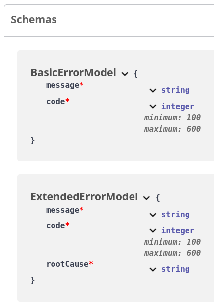
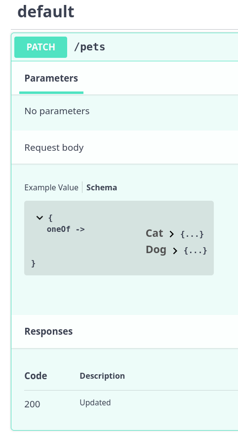
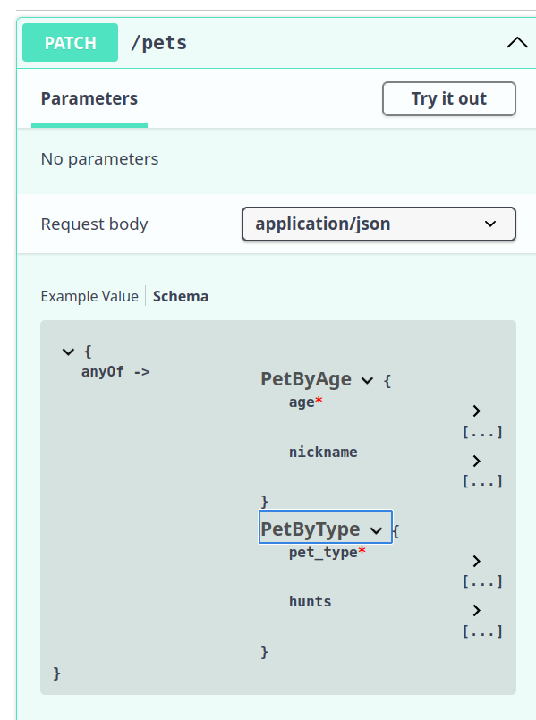
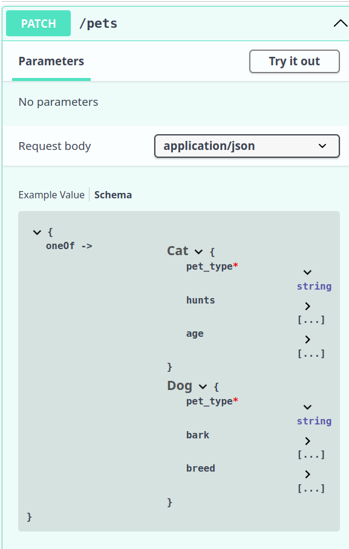
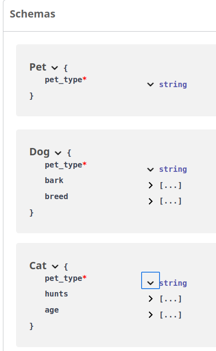

### 오늘 배운 것

Armeria 프레임워크 기여를 위해 이슈를 찾던 도중, Armeria의 DocService라는 API문서 생성기가 다형성과 상속 관계를 제대로 반영하지 못하고 있다는 이슈를 보고 관련 정보를 수집하고있다.

DocService와 비교되는 주요 라이브러리로 SpringDoc같은게 있는데, OpenAPI-Swagger의 문서 작성기능을 포함하고있으며 Jackson의 애노테이션들을 인식하여 문서화 하고있다. 그러면서 allOf, OneOf, AnyOf등 다양한 키워드를 통해 

1. 주어진 모든 하위 스키마(아래의 BasicErrorModel)에 대해 유효성을 검사하거나

2. 하위 스키마중 정확히 하나에 대해 유효성을 검사하거나

3. 하위 스키마중 하나 이상에 대해 유효성을 검사한다.


## 1. allOf

``` yaml

openapi: 3.0.0
info:
  title: Sample API
  version: 1.0.0
paths: {}
components:
  schemas:
    BasicErrorModel:
      type: object
      required:
        - message
        - code
      properties:
        message:
          type: string
        code:
          type: integer
          minimum: 100
          maximum: 600
    ExtendedErrorModel:
      allOf:
        - $ref: "#/components/schemas/BasicErrorModel"
        - type: object
          required:
            - rootCause
          properties:
            rootCause:
              type: string
```
위 yaml은 BasicErrorModel이라는 원본 클래스와 이를 상속한 ExtendedErrorModel에 대한 OpenAPI문서를 나타내는 파일이다.



yaml과 비교해보면, ExtendedErrorModel은 message와 code가 없으나 allOf로 BasicErrorModel을 상속받아서 자동으로 그 속성들을 보여주고있다.


## 2. oneOf

``` yaml
openapi: 3.0.0
info:
  title: Sample API
  version: 1.0.0p
aths:
  /pets:
    patch:
      requestBody:
        content:
          application/json:
            schema:
              oneOf:
                - $ref: "#/components/schemas/Cat"
                - $ref: "#/components/schemas/Dog"
      responses:
        "200":
          description: Updated

components:
  schemas:
    Dog:
      type: object
      properties:
        bark:
          type: boolean
        breed:
          type: string
          enum: [Dingo, Husky, Retriever, Shepherd]
    Cat:
      type: object
      properties:
        hunts:
          type: boolean
        age:
          type: integer

```

위 yaml은 /pets로의 patch메소드 요청에 대하여 어떤 스키마가 입력에서 들어가야 하는지 보여주는 문서를 만들기 위해 oneOf를 사용했다.

문서화 결과는 아래와 같다.

(참고로 cat, dog이 미지의 pet을 상속하고 있는지 여부는 아직 다루고 있지 않다.) 



oneOf를 사용할 경우, 이 메소드에 유효한 요청은 다음과 같다.

```
{ "bark": true, "breed": "Dingo" } // 가능한 두 객체중 하나(Dog)의 속성과 동일하다.


```

유효하지 않은 요청은 다음과 같다.

```
{ "bark": true, "hunts": true } //가능한 두 객체중 어느 하나와도 일치하지 않는다.
```


## 3. anyOf

anyOf는 oneOf와 비슷하면서도 약간 다르다.

``` yaml
paths:
  /pets:
    patch:
      requestBody:
        content:
          application/json:
            schema:
              anyOf:
                - $ref: "#/components/schemas/PetByAge"
                - $ref: "#/components/schemas/PetByType"
      responses:
        "200":
          description: Updated

components:
  schemas:
    PetByAge:
      type: object
      properties:
        age:
          type: integer
        nickname:
          type: string
      required:
        - age

    PetByType:
      type: object
      properties:
        pet_type:
          type: string
          enum: [Cat, Dog]
        hunts:
          type: boolean
      required:
        - pet_type


```



이 메소드에 유효한 요청 본문은 다음과 같다.

```
{"age":1}
{"pet_type": "Cat", "hunts": true}
{"nickname": "Fido",  "pet_type": "Dog", "age": 4
}

```

유효하지 않은 요청은 다음과 같다.
```
{ "nickname": "Mr. Paws", "hunts": false }
```
한가지 흥미로운 점은, anyOf와 oneOf는 유사하게 보인다는 것이다. 단순히 개념적으로 생각했을때, anyOf와 oneOf모두 "여러개 중 하나"의 의미라 헷갈리기 쉽다.

 그러나 oneOf는 요청 본문의 속성이 반드시 여러개중 하나의 스키마에만 속해야 하는 반면, anyOf는 여러 속성이 하나에만 속해도 되고, 각 스키마에 속한 속성이 섞여도 상관 없다.


## 4. discriminator

discriminator 키워드는 앞서 설명한 3가지 키워드와 함께 사용되며, 상속, 다형성 관계에서 구분자 역할을 맡는다. 예시와 함께 보자면,

``` yaml
MyResponseType:
  oneOf:
    - $ref: '#/components/schemas/Cat'
    - $ref: '#/components/schemas/Dog'
    - $ref: '#/components/schemas/Lizard'

```

위와 같은 스키마에 대하여, 사용자는 Cat, Dog, Lizard중 하나를 기대 할 수 있다. 

그러나 단순히 이렇게만 정의하면, 컴퓨터(서버나 클라이언트)는 실제 데이터가 이 셋 중 어떤 스키마에 해당하는지 판단하기 어렵다.

 모든 스키마를 하나씩 대입해보며 맞는 것을 찾아야 하는 비효율적인 과정을 거쳐야 한다. 이는 역직렬화(deserialization) 과정에서 성능 저하를 유발하고, 개발자가 어떤 타입의 객체를 만들어야 할지 결정하기 어렵게 만든다.

이러한 모호성과 비효율성을 해결하기 위해 discriminator 키워드가 사용된다. 판별자는 객체 내의 특정 필드를 **'꼬리표(label)'** 로 지정하여, 해당 객체가 어떤 타입인지 명확하게 알려주는 역할을 한다.

위 예시에 discriminator를 추가하면 다음과 같다.
```YAML

MyResponseType:
  oneOf:
    - $ref: '#/components/schemas/Cat'
    - $ref: '#/components/schemas/Dog'
    - $ref: '#/components/schemas/Lizard'
  discriminator:
    propertyName: petType # 'petType' 필드를 꼬리표로 사용
```
이제 discriminator를 통해 petType이라는 필드가 구분자로 지정되었다. 실제 응답 데이터는 다음과 같은 형태를 띤다.
```JSON

{
  "petType": "Dog",
  "bark": "loudly",
  "breed": "Husky"
}
```
API를 사용하는 클라이언트나 서버는 더 이상 모든 스키마를 추측할 필요가 없다. 먼저 petType 필드의 값을 확인하고, 그 값이 'Dog'이므로 이 데이터가 Dog 스키마에 해당한다는 것을 즉시 알 수 있다.


 ## 5. allOf+oneOf+discriminator로 상속과 다형성 표현하기

 allOf, oneOf, anyOf는 단순히 문서 작성을 위한 도움을 주는 키워드로서, 그 자체로 어떤 상속이나 다형성 같은 개념을 내포하고 있지는 않다. 그러나 어떤 상황에서 적절히 사용하면 객체지향의 개념을 나타낼 수 있다.

 ```yaml
paths:
  /pets:
    patch:
      requestBody:
        content:
          application/json:
            schema:
              oneOf:
                - $ref: "#/components/schemas/Cat"
                - $ref: "#/components/schemas/Dog"
              discriminator:
                propertyName: pet_type
      responses:
        "200":
          description: Updated

components:
  schemas:
    Pet:
      type: object
      required:
        - pet_type
      properties:
        pet_type:
          type: string
      discriminator:
        propertyName: pet_type

    Dog: # "Dog" is a value for the pet_type property (the discriminator value)
      allOf: # Combines the main `Pet` schema with `Dog`-specific properties
        - $ref: "#/components/schemas/Pet"
        - type: object
          # all other properties specific to a `Dog`
          properties:
            bark:
              type: boolean
            breed:
              type: string
              enum: [Dingo, Husky, Retriever, Shepherd]

    Cat: # "Cat" is a value for the pet_type property (the discriminator value)
      allOf: # Combines the main `Pet` schema with `Cat`-specific properties
        - $ref: "#/components/schemas/Pet"
        - type: object
          # all other properties specific to a `Cat`
          properties:
            hunts:
              type: boolean
            age:
              type: integer

 ```


 이 예제에서, super class인 pet을 상속한 dog와 cat이 있으며, pet의 배열을 patch하는 API가 있다. 이때 사용자는 cat이나 dog를 보내면 자연스럽게 pet 리스트에 등록되는 것을 기대할 것이다. 그리고 allOf, oneOf, discriminator라는 키워드는 다음과 같은 역할을 한다.

 - schema에서 쓰인 allOf는 문서상에서 pet스키마의 속성을 중복없이 받아오면서 자연스레 상속의 역할을 한다.

-  API파트에서 사용된 oneOf는 Cat, Dog 둘 중 하나를 입력으로 받을 것을 기대하면서 자연스럽게 다형성을 의미하게 된다.

- discriminator라는 키워드는 Cat, Dog의 모호성을 해결하는 스위치 역할을 한다. 


아래 문서를 참고하면 어떤식으로 문서화 되는지 알 수 있다.






### 내일 할 일
1. Real MySQL 공부