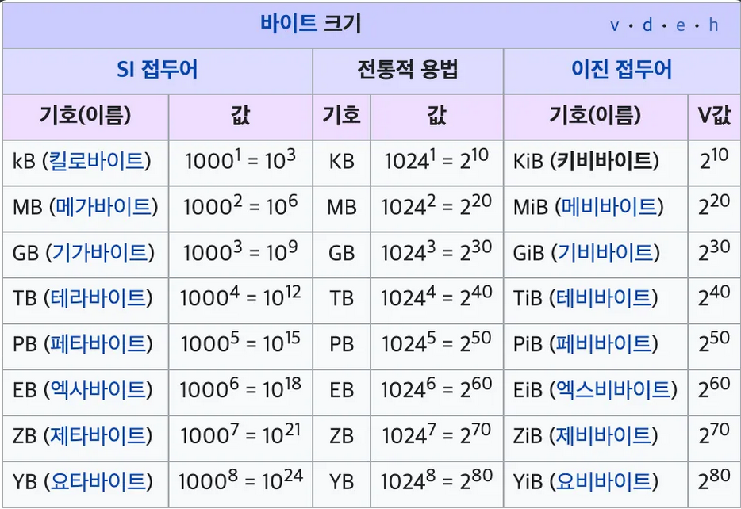
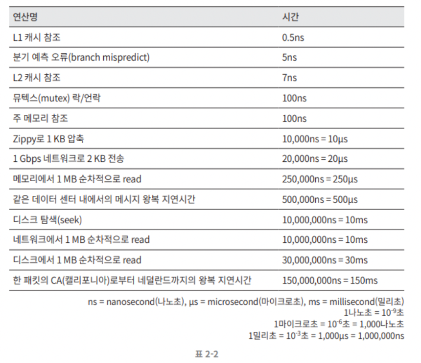
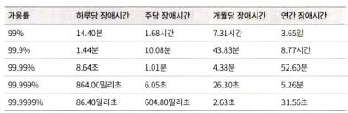

### 오늘 한 것

# 2장 개략적인 규모 추정

알고리즘 문제에서 O(N) 시간을 가늠하며 알고리즘을 선정하는 것 처럼 시스템 설계에도 이런게 있다.

## 2의 제곱수

KB, MB, bit, Byte의 관계를 아는것부터 시작한다.

대체로 1KB=1000Byte 혹은 1024Byte 의 관계가 있다.

## 모든 프로그래머가 알아야 하는 응답지연 값

주안점

- 디스크는 너무 느리니 가능한 메모리를 써라
- 단순한 압축 알고리즘은 빠르다
- 데이터를 전송하기 전에 가능하면 압축하라
- DC는 분산되어 있으므로 DC사이에서 주고받으려면 시간이 걸린다.

## 가용성에 관계된 수치들

SLA(Service Level Agreement) 서비스 사업자가 보편적으로 쓰는 용어. 고객과의 합의, 서비스의 가용시간이 공식적으로 기술되어잇음, 구글 아마존 마소 같은 경우 99%이상.

## 예제: 트위터 QPS(초당 쿼리 횟수)와 저장소 요구량 측정

## 팁
- 근사치를 써서 계산하기. 
- 가정을 써두기
- 단위를 붙여라
- 주로 나오는 개략적 규모 추정 문제는 QPS, 최대 QPS, 저장소 요구량, 캐시 요구량, 서버 수 추정이다.

# 3장 시스템 설계 면접 공략법

챗봇 서비스를 설계해 보라 !

고 햇을때 완벽하게 다 짜는걸 바라지는 않는다.

이걸 면접에서 보면서 1. 기술역량, 2. 협업, 소통역량, 3. 문제 접근법을 본다.

이건 결과보다 과정을 훨씬 더 중요시한다. 

## 효과적 면접을 위한 4단계 접근법

### 1단계 문제 이해 및 설계 범위 확정

절대로 성급하게 답을 내려고 하지 마라. 요구사항과 가정들을 
분명히 하라. 

- 구체적으로 어떤 기능을 만들어야 하냐
- 제품 사용자 수는 얼마나 되냐
- 회사 규모는 얼마나 빨리 성장하고있냐
- 회사의 주요 기술스택이 뭐고, 첨부터 만드는거냐 아니면 기반 시스템이 있냐

#### 예제

### 2단계 개략적인 설계안 제시 및 동의 구하기
개략적인 설계안 제시하고 동의를 구하기

- 최소 청사진을 제시하고 의견 구하기
- 화이트보드에 그리기
- 최초 설계안이 요구사항을 만족하는지 개략적으로 계산, 소리내서 계산과정을 설명 

#### 예제

### 3단계 상세 설계

- 시스템에서 전반적으로 달성해야할 목표 재확인
- 전체설계 개략적 청사진
- 청사진에 대한 면접관 의견 듣기
- 상세 설계에서 집중해야할 사항 확인

### 4단계 마무리

- 면접관이 병목구간, 개선지점 찾으라 요구. 개선할 점은 언제나 존재하므로 뭐든 찾아보자.

- 설계 재요약
- 오류가 생기면 어떻게 되나 따라가보기

- 운영 이슈, 메트릭, 모니터링 어떻게. 로그와 배포 어떻게

- 미래 확장요구 대처방안

#### 해야할것

- 질문을 통해 확인하라

- 문제의 요구사항을 이해해라

- 정답이나 최선의 답안은 없다. 스타트업과 중견기업의 설계안이 같을 리가 없다.

- 면접관이 우리의 사고 흐름을 이해할 수 있도록 하라.

- 여러 해법을 제시해라

- 개략적 설계에 면접관이 동의하면, 각 컴포넌트의 세부사항을 설명해라..

- 면접관의 아이디어를 이끌어내라. 면접관을 팀원처럼 사용해라

- 포기하지 마라

#### 하지 말아야 할것
- 전형적인 문제를 준비하라
- 요구사항이나 가정이 부족한 상황에서 설계하지 마라
- 특정 컴포넌트를 시작부터 자세히 설명하지 마라
- 진행중에 막혔다면 힌트를 요청해라
- 소통을 주저하지 말고, 침묵을 금하라
- 설계안을 내놓는게 끝난게 아니라 면접관이 끝났다고 할때 긑났다. 계속 생각해라

#### 대략적인 시간 배분