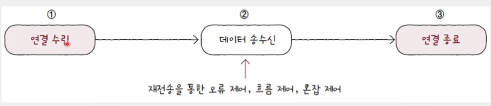
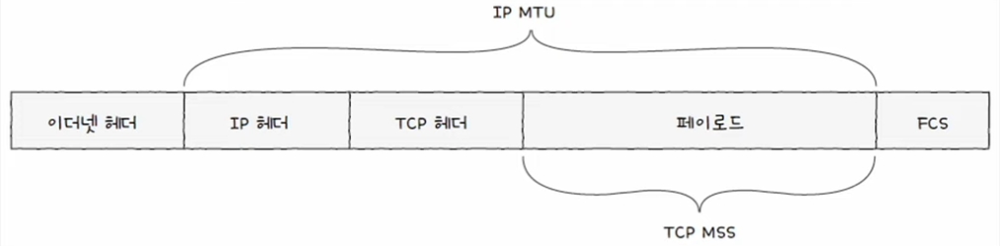
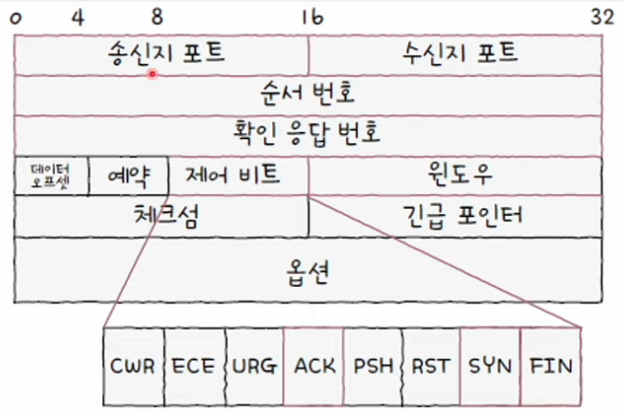

혼자공부하는 네트워크 4장 ( 190p ~ 249p)

OSI 7계층 복습

| 계층      | 계층 이름                       | PDU(데이터 단위)                                   |
| ------- | --------------------------- | --------------------------------------------- |
| **1계층** | 물리 계층 (Physical Layer)      | **Bits (비트)**                                 |
| **2계층** | 데이터 링크 계층 (Data Link Layer) | **Frame (프레임)**                               |
| **3계층** | 네트워크 계층 (Network Layer)     | **Packet (패킷)**                               |
| **4계층** | 전송 계층 (Transport Layer)     | **Segment (세그먼트, TCP)** **Datagram (UDP)** |
| **5계층** | 세션 계층 (Session Layer)       | **Data** (혹은 Message)                         |
| **6계층** | 표현 계층 (Presentation Layer)  | **Data** (혹은 Message)                         |
| **7계층** | 응용 계층 (Application Layer)   | **Data** (혹은 Message)                         |

567을 뭉뚱그려 응용계층이라고도 함(인터넷 5계층)

# 4-1 : 전송 계층의 개요: IP의 한계와 포트

3- 네트워크 계층의 대표적 프로토콜인 IP는 UnReliable, non-connection 통신의 한계가 있다.

## 신뢰할 수 없는 통신과 비연결형 통신

* 무엇을 Reliable이라고 하는가?
1. 패킷이 손상되거나 중복되어도 확인 X
2. 재전송 X
3. 순서 보장도 X

이런걸 `최선형 전달` 이라고도 한다, 이런 "best effort"는 최선을 다해보겠지만, 장담 못한다는 의미.

* 비연결형의 의미 : 말그대로 연결 안하고 그냥 던진다는 의미

---

* 그럼 왜 IP는 이렇게 했을까?

- 성능때문에, 패킷의 빠른 송수신을 위해서.
- Reliable이 항상 요구되는것은 아님. 동영상 스트리밍, 실시간 영상통화는 속도가 우선이라 중간에 한 두 패킷정도는 없어도 됨.

        책에서 나오진 않았으나, 전공과정에서 설명하기를, 계층형 구조의 특징상 아래에 있는건 아무것도 안할수록 좋다. 예를들어, 3계층인 IP가 빡빡하게 구현되어 있을수록 위쪽 계층의 TCP나 UDP는 자동으로 IP의 빡빡함을 따라간다.

## IP의 한계를 보완하는 전송계층(Transport Layer)

### 1. 전송계층은 연결형 통신을 가능하게 한다. (TCP만)

### 2. 전송계층은 신뢰성 있는 통신을 가능하게 한다. (TCP만)

## Application 계층과의 연결다리, 포트

### 포트의 정의

패킷이 3계층에 의해 end to end로 일단 내 컴퓨터에 도착했다고 치면, 이걸로 끝나는게 아니라 브라우저로 가는건지 다른 애플리케이션으로 가는건지 정해야 한다. 이때 필요한게 PORT이다.

### 포트의 분류

4계층에서는 PORT를 사용해 특정 애플리케이션을 식별한다. 패킷 내 수신지 포트와 송신지 포트를 통해 송수신지 호스트의 애플리케이션을 식별한다.

TCP, UDP모두 송수신지 포트번호를 포함한다. 포트번호는 16Bit로 표현되며 0~65535번까지 존재한다.

| 구분                                                 | 포트 번호 범위          | 설명                                                                      |
| -------------------------------------------------- | ----------------- | ----------------------------------------------------------------------- |
| **Well-Known Ports (잘 알려진 포트)**                    | **0 ~ 1023**      | 전 세계적으로 표준화된 서비스들이 사용. OS가 권한 필요. 예: HTTP 80, HTTPS 443, SSH 22, DNS 53 |
| **Registered Ports (등록된 포트)**                      | **1024 ~ 49151**  | 특정 기업/단체/서비스가 IANA에 등록해 사용. 예: MySQL 3306, PostgreSQL 5432, Redis 6379  |
| **Dynamic / Private / Ephemeral Ports (동적/사설 포트)** | **49152 ~ 65535** | 클라이언트가 임시로 사용하는 포트. 연결 시 OS가 자동 할당. 예: 웹 브라우저가 HTTP 요청 시 임시 포트 사용       |

---

그럼 잘 알려진 포트와 등록된 포트를 관리하는 주체가 어디일까?
`IANA 인터넷 할당 번호 관리 기관` 이라는 국제단체가 있다.

이 포트번호 예시는 관례상의 권고이고, 얼마든지 바꿀 수 있다. 

한편 49152 이상의 포트는 동적포트, 사설포트, 임시포트 라고 하는데, 자유롭게 사용할 수 있다.

보통 서버로서 동작하는 프로그램이 잘알려진 포트(0~1023)와 등록된 포트(1024~49151)로 동작하는 경우가 많다. 

클라이언트로서 동작하는 프로그램은 동적포트로 동작한다(49152~65535) 웹 브라우저는 특정 웹사이트와 패킷을 주고받을때 임의의 포트로 주고받는다. 책에서는 55771이라는걸로 한다.

IP:PORT 로 특정 애플레키에션 프로세스를 식별한다.
## 포트기반 NAT(Network Address Translation)

NAT: IP주소를 변환하는 기술, 주로 네트워크 내부에서 사용되는 사설IP주소와 공인 IP주소를 변환하는 데 사용된다. 

### NAT 변환 테이블

이 과정에서 NAT테이블이 라우터에 있어서 내외 통신에서 테이블을 참조하여 나가고 들어오는데, 한가지 살펴봐야 할 점이 있다. 사설 IP주소와 공인 IP주소가 일대일 대응된다면, 네트워크 내부에서 사용되는 사설IP주소의 수 만큼 공인 IP주소가 필요하기 때문이다. 

> 자세히 설명하자면, 예를들어 사설 IP주소가 1.2.3.(12345) 5개라면, 공인 IP로 나갈때 5.6.7.(89101112) 5개가 필요하다. 그런데 이러면 사설IP주소로 나눈 의미가 없다. 그래서 포트번호까지 사용해서 사설IP주소를 나눌때 쓰고, 공인IP주소를 5.6.7.8로만 쓴다던가 한다.

### NAPT(Network Address Port Translation)

포트기반의 NAT를 NAPT라고 한다. NAT테이블에 IP주소:PORT번호로 놓아서 하나의 공인 IP주소를 여러 사설 주소가 공유하도록 한다. 

이 방법으로 NAPT는 공인IP주소 부족문제를 해결한다.

## 포트포워딩

포트포워딩이란 "네트워크 내 특정 호스트에 IP주소와 포트 번호를 미리 할당하고 해당 IP주소:포트번호로서 해당 호스트에게 패킷을 전달하는 기능이다"

주로 네트워크 내부의 서버를 외부에서 접속할 수 있도록 접속 정보를 공개하기 위해 사용한다.

## ICMP

3- 네트워크 계층의 IP의 unreliable, non connection을 보완하기위해 ICMP(Internet Control Message Protocol)이 있다. IP 패킷의 전송과정에 대한 피드백 메시지(ICMP메시지)를 얻기위해 사용한다.

ICMP메시지의 종류로는 크게
1. 전송과정에서 발생한 문제상황에 대한 오류 보고
2. 네트워크에 대한 진단정보가 있다.

오류보고를 위한 ICMP메시지 타입은 대표적으로
- 수신지 도달 불가
- 시간초과

가 있다.

traceroute, tracert가 ICMP메시지를 기반으로 동작하는 명령어다.
또 Ping도 그렇다.

ICMP는 IP의 신뢰를 보조하기 위한 도우미일 뿐이다.

> 전공과정에서 ICMP는 3계층이긴 하지만 IP 위에 있기때문에 3.1계층이라고 한다고 들었다.

# 4-2 : TCP와 UDP

## TCP 통신 단계와 세그먼트 구조

TCP 통신을 3단계로 나누면 다음과 같다.

1. 연결 수립
2. 데이터 송수신(재전송을 통한 오류제어, 흐름제어, 혼잡제어)
3. 연결 종료

TCP의 연결수립과 종료를 이해하려면 MSS라는 단위와 세그먼트 구조를 이해해야 한다.

`MSS(Maximum Segment Size)` : TCP로 전송할 수 있는 최대 페이로드 크기

MSS 크기를 고려할때, TCP 헤더의 크기는 제외한다.(MTU와는 다른점)

TCP 세그먼트의 구조를 간략하게 보자.

- 송수신지의 `포트`
- 순서 번호 : 세그먼트의 순서보장
- 확인 응답번호 : ack임, 다음으로 수신하기를 기대하는 순서 번호

- 제어 비트 : 플래그 비트들
- 윈도우 : 수신 윈도우의 크기

### 제어비트

ACK : 세그먼트의 승인을 나타내기 위한 비트
SYN : 연결을 수립하기 위한 비트
FIN : 연결을 종료하기 위한 비트

### 순서 번호(SEQ) 와 확인 응답 번호 (ACK)

TCP의 신뢰성을 보장하기 위해 사용되는 중요한 필드, 묶어서 기억하는게 좋다.

1. 순서 번호 SEQ

5-응용계층으로부터 1900 Byte를 받았고 MSS가 500 Byte라고 하면, 4개로 나눌 수 있다. (500*3+400)

처음 통신을 위해 연결을 수립한 경우, 초기 순서 번호 (ISN: Initial Sequence Number)가 무작위 값이 된다. 100이라고 치면 연결 수립 이후 순서번호는 ISB+송신한 바이트 수가 된다.

100, 600, 1100, 1600가 된다.

2. 확인 응답 번호 ACK

ACK는 SEQ에 대한 응답이다. 일반적으로 수신한 순서번호+1이다.

## TCP연결 수립과 종료

TCP는 통신 이전에는 연결을 수립하고, 통신 이후에는 연결을 종료한다. 연결에 대해 알아보자.

### 연결 수립 : 3-way Hand Shake

A->B : SYN
B->A : SYN+ACK
A->B : ACK

이때 1번을 Active Open
2번을 Passive Open이라고도 한다.

### 연결 종료

A->B : FIN
B->A : ACK
B->A : FIN
A->B : ACK

1번이 액티브 클로즈
3번이 패시브 클로즈

## TCP 상태

TCP는 connec, reliable을 위해 `상태`를 유지한다.

Stateful Protocol 이라고도 한다.

### 미연결상태

- Closed : 아무런 연결이 없는 상태
- Listen : 일종의 연결대기상태, 일반적으로 서버로 동작하는 패시브 오픈 호스트는 LISTEN상태를 유지한다. 연결수립의 첫 SYN을 기다리는 단계다.

### 연결 상태
(그림으로 봐야 이해가 쉽다.)
- SYN-SENT
- SYN-RECEIVED
- ESTABLISHED

### 연결 종료 상태

- FIN-WAIT-1
- CLOSE-WAIT
- FIN-WAIT-2
- LAST-ACK
- TIME-WAIT

## UDP 데이터 그램 구조

TCP와 달리 비연결형 통신을 수행하는 신뢰할 수 없는 프로토콜. 

상태를 유지하지도, 사용하지도 않아서 `stateless` 프로토콜 이라고도 함.

데이터그램 헤더도 단순히 

- 송수신지
- 길이
- 체크섬

으로 구성됨

주로 실시간 스트리밍, 인터넷 전화처럼 실시간성이 중요한 곳에 쓰인다.

# 4-3 : TCP의 오류, 흐름, 혼잡제어

앞서 TCP의 연결 수립과 종료(3-way handshake, 4-way handshake), syn, synack, ack / fin ack fin ack

를 봤다. 이제 그 중간인 데이터 송수신 에서의
1. 오류
2. 흐름
3. 혼잡 
제어를 보자.

## 오류 제어 : 재전송 기법

### 오류 검출과 재전송
TCP 세그먼트에 체크섬 필드가 있으나 이걸로는 부족하다. 훼손 여부만 나타내고 호스트는 해당 패킷을 버리기 때문이다. 따라서 송신 호스트가 문제를 인지할 수 없다.

따라서 신뢰성을 보장하려면 

1. 송신 호스트가 자기가 보낸게 잘못됐다고 알아야 한다.
2. 오류를 감지하면 재전송 해야 한다.

#### 1. 중복된 ACK 세그먼트를 수신했을 때

n을 보내고 N+1 ack을 받고 또 n+1을 보냈음에도 N+1 Ack이 오면 뭔가 문제가 생긴거다.

        RTT: Round Trip Time : 메세지를 전송하고 받기까지 걸린 시간. ping 명령어로 조회할 수 있다.

#### 2. Time Out 발생했을 때
송신 호스트는 재전송 타이머(retransmission timer) 값을 유지한다. 세그먼트를 전송할 때마다 타이머를 시작하는데 이게 끝나면 타임아웃이다. 타임아웃 되면 다시 보낸다.

### ARQ: 재전송 기법

ㅇㅋ 이제 재전송 해야한다는걸 알았다. 그럼 어떻게 할까?
ARQ(Automatic Repeat REquest) 자동 재전송 요구.

ARQ의 종류는 다양한데, 이제 3가지 방식을 알아보자.

        참고로 ARQ는 4계층만의 기술은 아니다.

### Stop And Wait ARQ
가장 단순한 방식. 하나 보내고 하나 확정되야 다음거 보낸다.

네트워크 이용 효율이 낮아서 요즘엔 잘 안쓰지만 신뢰성은 굉장히 높다. 

### Go-Back-N ARQ

파이프라이닝을 도입했다. 오늘날의 TCP는 고백n과 selective Repeat ARQ를 기반으로 동작한다.

일단 여러 세그먼트를 보내고 문제가 생기면 그 세그먼트부터 전부 다시 전송한다. 교재 그림은 한 페이지 뒤의 `빠른 재전송`(fast retransmit)과 섞여서 n+1 ack가 두번 나와있는듯 하다.

고백nARQ에서 n-ack의 세그먼트는 n번만의 ack이 아니라, 0~n번까지 받았다는 의미가 되므로 CACK(Cumulative ACK)이라고도 한다.

        `빠른 재전송` timeout 되기 전이라도, ack이 3번온다면 즉시 재전송 한다.
### Selective Repeat ARQ

선택적으로 재전송한다. 고백nARQ는 12345 보냈다가 3문제 생기면 345를 다시 보내야 했는데, 이건 3만 보내게 한다. 고백n과 달리 개별 확인 응답인 셈이다.

오늘날 대부분의 호스트는 TCP에서 Selective Repeat ARQ를 지원한다. 연결을 수립할때 이 SRARQ의 지원여부를 확인하는데, 만약 SRARQ를 사용하지 않을 경우 고백N으로 동작한다.

## 흐름제어 : 슬라이딩 윈도우
파이프라이닝 기반의 고백N과 SRARQ는 호스트가 한번에 받아 처리할 수 있는 세그먼트의 수에 제한이 있으므로 흐름제어가 필수다. 

흐름제어는 수신버퍼의 오버플로를 방지하기 위해 송신호스트가 수신 호스트의 처리속도를 고려하여 송수신 속도를 균일하게 유지하는 것이다. 사실 STOP and wait면 응답이 와야 보내므로 상관 없는데 나머지 2개는 파이프라이닝이라 이런게 더 필요하다.

`윈도우`란 송신 호스트가 파이프라이닝 할 수 있는 최대량을 의미한다. 수신호스트도 윈도우를 고려하는데, 사실 송신윈도우는 수신 윈도우를 토대로 알 수 있는 정보다. TCP 세그먼트 헤더에 윈도우라는 필드가 있는데, 수신 윈도우의 크기가 명시되어 송신 호스트는 이걸보고 윈도우 사이즈를 정한다.

오늘날에는 슬라이딩 윈도우를 사용한다. 

## 혼잡 제어

`혼잡` 이란 많은 트래픽으로 인해 패킷 처리속도가 느려지거나 유실될 우려가 있는 네트워크 상황을 말한다.

재전송때문에 혼잡상황을 오히려 가중시켜 TCP초기에 문제가 되었다.

흐름제어의 주체가 수신호스트라면, 혼잡 제어의 주체는 송신 호스트다. 혼잡 제어를 수행하는 송신호스트는 혼잡도를 판단하고 유동적으로 전송량을 조절한다.

`혼잡 윈도우`는 혼잡 없이 전송할 수 있을법한 데이터양을 의미한다. 

송신 호스트 입장에서 생각하면, 흐름제어는 수신호스트가 알려주니까 그거 쓰면 되는데, 혼잡제어는 스스로 계산해야 한다.

AIMD알고리즘(Additive Increase / Multiplicative Decrease), 합으로 증가, 곱으로 감소, 톱니모양의 그래프가 기본이다.

혼잡이 없으면 +1씩 혼잡 윈도우 크기를 늘리고, 혼잡이 감지되면 1/2한다. 
### Slow Start 알고리즘

혼잡이 없으면 +1이 아니라 *2로 늘어나다가. 

1. 느린시작 임계치(slow start Threshold) 이상이 되거나.
2. 타임아웃이 발생하거나
3. 3번 이상의 중복된 ACK을 받으면 3가지 방법중 하나를 선택한다.

| 상황 (Condition) | 혼잡 판단 (Diagnosis) | 대응 및 값 변화 (Action) | 다음 단계 (Next Phase) |
| :--- | :--- | :--- | :--- |
| **1. 임계치 도달** (cwnd $\ge$ ssthresh) | **정상** (이제 천천히 늘리자) | **선형 증가 (+1)** 지수 증가($\times 2$)를 멈춤 | **혼잡 회피** (Congestion Avoidance) |
| **2. 타임아웃** (Timeout 발생) | **심각한 혼잡** (아예 전송 불가) | **초기화** ssthresh = cwnd / 2 cwnd = 1 | **Slow Start** (처음부터 다시 시작) |
| **3. 3개의 중복 ACK** (3 Duplicate ACKs) | **경미한 혼잡** (일부 패킷만 유실) | **절반으로 감소** ssthresh = cwnd / 2 cwnd = ssthresh | **빠른 회복** (Fast Recovery) |

### 혼잡 회피 알고리즘 Congestion Avoidance

RTT마다 혼잡 윈도우를 1MSS(Maximum Segment Size)씩 증가시키는 알고리즘, 선형적으로 윈도우 크기를 올린다. 의미는 `느린시작 임계치를 넘으면 위험하니까 천천히 가자`

이때 타임아웃이 발생하면 윈도우는 1이되고, 임계치는 원래의 절반이 된다. 다시 느린시작 수행.
3번의 중복 ACK이 발생하면 윈도우와 임계치를 절반으로 낮추고 `빠른회복` 수행

물론 타임아웃 세그먼트나 중복 ACK 세그먼트는 재전송.

### 빠른 회복 알고리즘 Fast Recovery
3번의 ACK을 먹으면 빠른 재전송과 `빠른 회복`이 동작한다. 3번의 중복 ACK 받으면 `느린시작`으로 가지 말고, `혼잡회피`를 수행한다. 빠르게 전송률을 회복하기 위한 알고리즘. 
단, `빠른회복` 중이라도 타임아웃 발생하면 윈도우 크기는 1로, 임계치는 절반으로 떨구고 `느린시작`을 수행한다.

## ECN : 명시적 혼잡 알림

앞서 혼잡제어를 송신호스트만의 것으로 설명했는데, 중간장치(라우터)의 도움을 받는 ECN이 생겼다.

선택적이라서 되는게 있고 안되는 호스트가 있다. IP헤더 서비스 유형 필드에 ECN 여부가 있다.

