# 9-1 운영체제를 알아야 하는 이유

메모리 커널영역에 운영체제가 로딩됨.

자원할당, 프로그램 실행을 돕는 SW가 운영체제

커널영역에 로딩된다. 

- 메모리 관리

- 스케줄링

- 입출력 장치 관리

# 9-2 운영체제의 큰 그림

## 커널이란?

운영체제의 핵심 서비스를 담당하는 부분

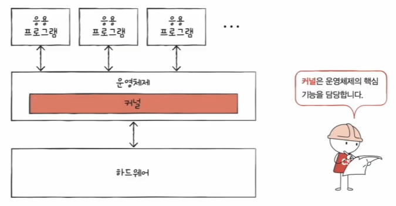

예를들어, 유저 인터페이스는 OS에는 속하지만, 커널엔 속하지 않는다.

## 운영체제의 서비스 종류?

이중모드와 시스템 호출.

커널 모드, 사용자 모드 

커널모드는 운영체제의 서비스 모두 가능.

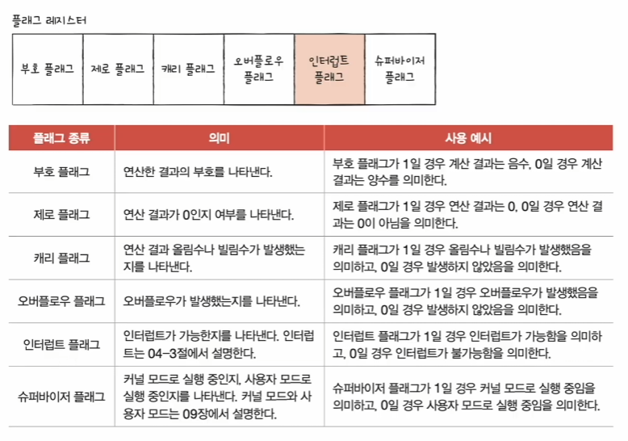

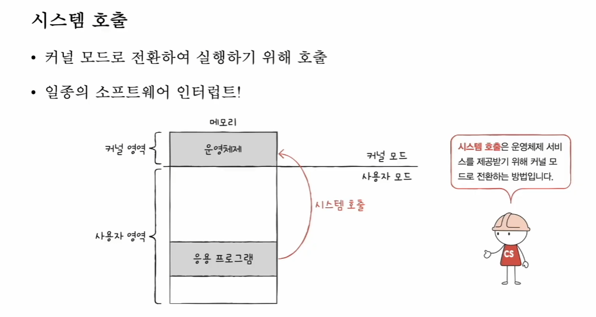

시스템 콜도 일종의 SW인터럽트다.

HW인터럽트 처리방식과 유사하다.

운영체제의 핵심 서비스

- 프로세스 관리

- 자원 접근 및 할당

--CPU, 메모리, IO장치

- 파일 시스템 관리

## 시스템 콜과 이중 모드란?

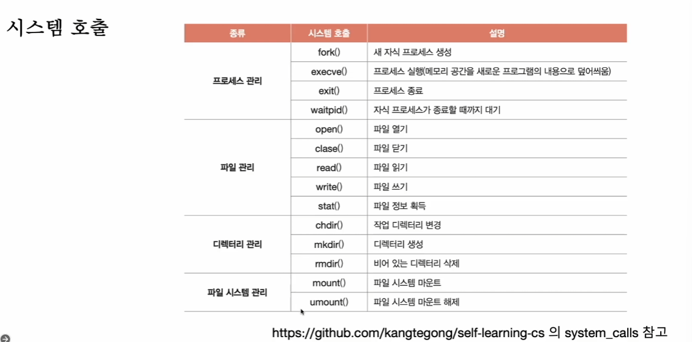

# 9 - 추가 시스템 호출 직접 관리

# 10-1 프로세스 개요

프로세스 = 실행중인 프로그램

ForeGround Process = 사용자가 볼 수 있는 공간에서 실행되는 프로세스

BackGround Process = 사용자가 볼 수 없는 영역에서 실행되는 프로세스

그 중에서도, 사용자와 직접 상호작용 가능한 프로세스와 그저 정해진 일만 하는 프로세스

프로세스 제어 블록
- 할당된 시간만큼 CPU사용. 
타이머 인터럽트 발생 시 차례 양보

빠르게 수행되는 프로세스를 관리하는
자료구조가 프로세스 제어블록 PCB

프로세스 생성 시 커널 영역에 생성, 종료 시 폐기.

- PID
-레지스터 값
  다시 내 차례 왔을때 이전까지 쓰던 레지스터 중간값을 복원
-프로세스 상태
-CPU 스케줄링 정보

- 메모리 정보
-사용한 파일과 IO장치 정보

문맥 교환 (Context Switch)

- 한 프로세스에서 다른 프로세스로 실행 순서가 넘어가면?

A는 중간정보를 백업. = 문맥

문맥을 백업해두면 그 프로세스 실행 재개 가능

B 문맥을 복구하고 B 실행...

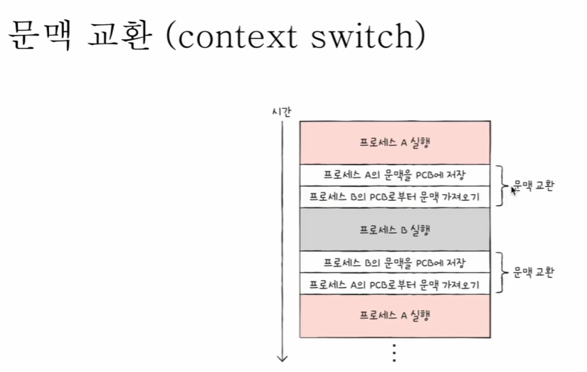

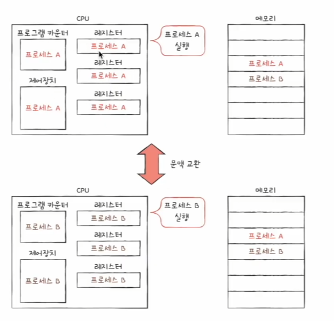

PCB가 커널영여게 있다면, 사용자 영역은 뭐로 구성되었나.

1. 코드 영역(=텍스트 영역)
readOnly 영역. CPU가 실행할 명령어가 담김

2. 데이터 영역

전역변수, 실행되는 동안 유지할 데이터 저장

3. 힙 영역

동적할당한 것들. 메모리 누수 조심

4. 스택 영역

일시적 저장 공간. 쓰다 말 값들 공간

매개변수, 지역변수

힙과 스택 크기는 가변적

일반적으로 힙은 낮은 주소 -> 높은 주소

스택은 높은 주소 -> 낮은 주소

스택이 아래서 쌓는게 아니라 반대라는것만 기억하자

# 10-2 프로세스 상태와 계층 구조

실행중, 임시중단됨 .... 

PCB 에 기록되는 프로세스 상태

1. 생성 상태
이제 막 메모리에 적제되어 PCB를 할당 받은 상태

2. 준비 상태
당장 CPU할당받아 실행할 수 있지만, 내 차례 아니라 기다리는 상태

3. 실행 상태

실행중인 상태, 모두 사용 시 준비상태로
실행 도중 IO 장치 사용 시 IO끝날때까지 대기상태로

4. 대기 상태

프로세스가 실행도중 IO 장치를 사용하는 경우
IO는 CPU에 비해 느리기에 대기상태로 접어듬
IO끝나면(IO완료 인터럽트 받으면) 준비상태로

5. 종료 상태.

PCB, 메모리 영역 정리

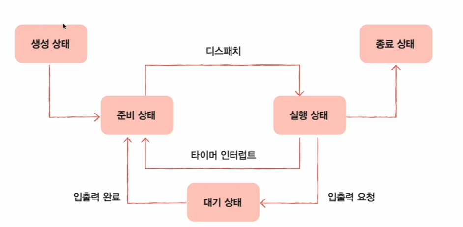

계층구조

부모 프로세스와 이에 생성된 자식 프로세스.

각기 다른 PID, Parent PID PPID를 명시하기도 함

---
복제와 옷 갈아입기

부모는 FORK 로 자신의 복사본을 자식 프로세스로 생성

자식은 exec로 자신의 메모리 공간을 다른 프로그램으로 교체

exec - 메모리 공간을 새로운 프로그램으로 덮어쓰기, 코드/데이터 영역은 실행할 프로그램 내용으로 바뀌고, 나머지 영역은 초기화

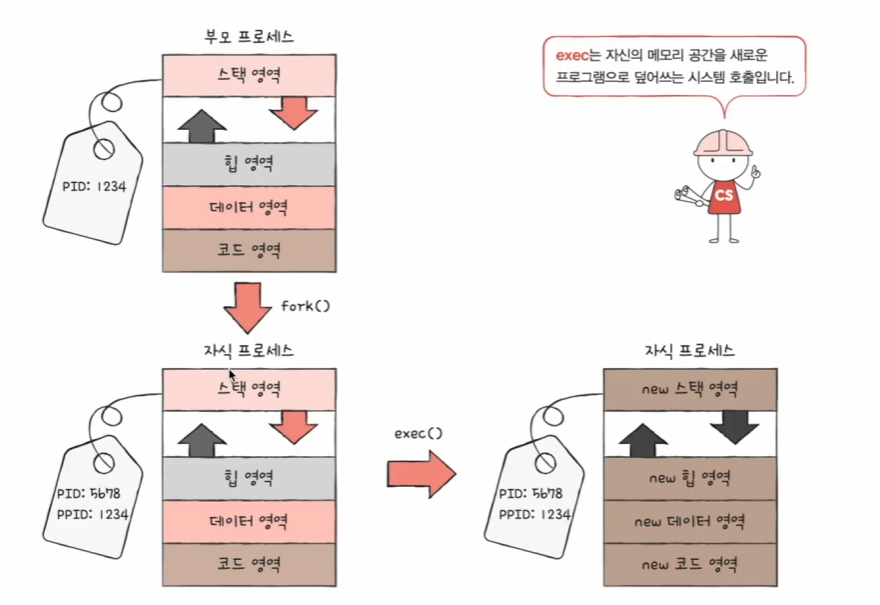

그림자 분신술 하고 변신술 쓴다고 생각하면 된다.

*** 왜 바로 안하고 복사 하고 옷갈아입을까

# 10-3 스레드

프로세스를 구성하는 실행 흐름의 단위

하나의 프로세스는 하나 이상의 스레드를 가질 수 있다.

스레드의 구성 요소

Thread ID

프로그램 카운터를 비롯한 레지스터 값

스택 등 실행에 필요한 최소한의 정보

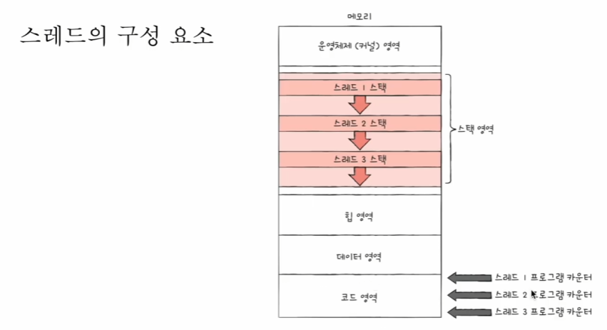

*** 쓰레드는 프로세스의 자원을 공유하면서 실행된다. ***

*** 리누스 토르발즈님은 프로세스와 스레드는 그냥 "실행의 문맥"일 뿐이라고 생각하신다. 그래서 task로만 한다. ***

---

멀티프로세스와 멀티스레드

동일한 작업을 수행하는 단일 스레드 프로세스 여러개 실행
vs
하나의 프로세스를 여러 스레드로 실행

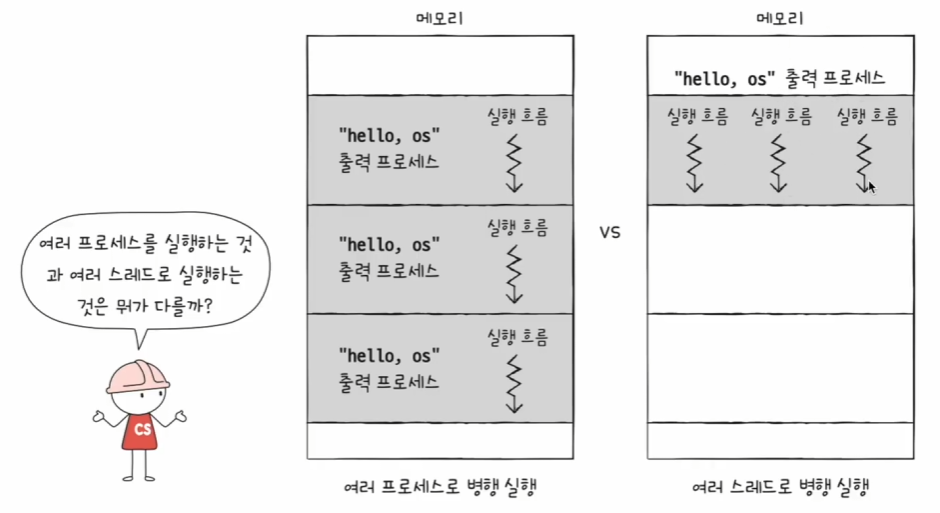

멀티 프로세스는 메모리 너무 많이 먹는다

프로세스를 FORK 하면 코드/데이터/힙 모든 자원이 복제되어 저장됨

같은 프로세스가 n개 적재됨.

참고) fork직후 같은 프로세스를 통째로 메모리에 중복 저장하지 않으면서, 동시에 프로세스끼리 자원을 공유하지 않는 기법을 Copy on Write 라고 한다.

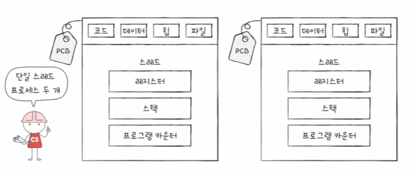

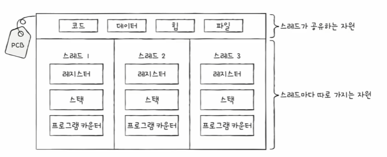

프로세스끼리 자원을 공유하기 위해

프로세스간 통신 IPC
그리고 파일을 통한 프로세스 통신, 공유메모리를 통한 프로세스간 통신

# 10-추가1 파이썬 코드로 프로세스 다루기

# 10-추가2 파이썬 코드로 스레드 다루기

# 11-1 CPU스케줄링 개요

OS가 프로세스에게 공정하고 합리적으로 CPU자원을 배분하는것

가장 공정한??

기본적으로, IO가 많은 프로세스의 우선순위는 CPU작업이 많은 프로세스의 우선순위보다 높다.

스케줄링 큐를 둬서,

1. CPU를 쓸 프로세스 큐
2. HDD 쓰고싶은 프로세스 큐
3. 프린터 쓰고싶은 프로세스 큐

꼭 선입선출일 필욘 없다

준비 큐와 대기 큐

준비 큐 - CPU 대기줄

대기 큐 - IO 대기 줄

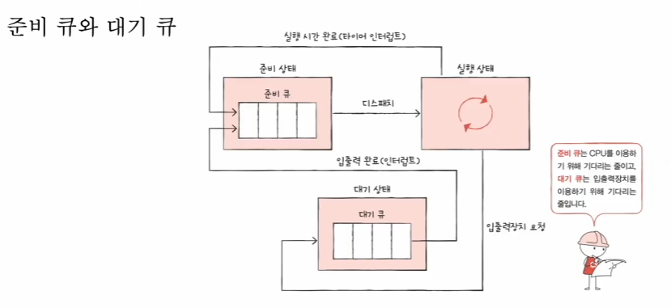

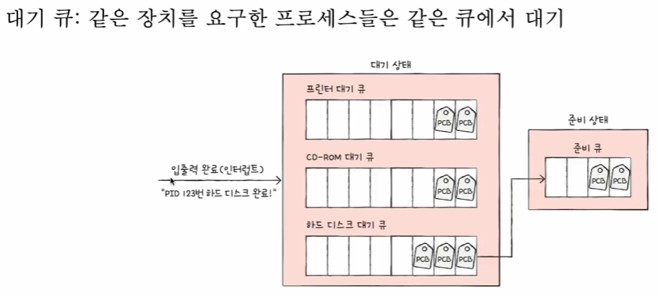

같은 큐 에서도 우선순위에 따라 정해진다.

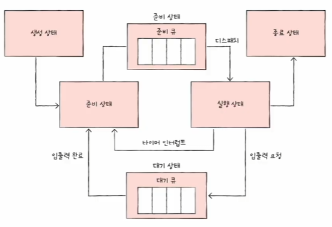

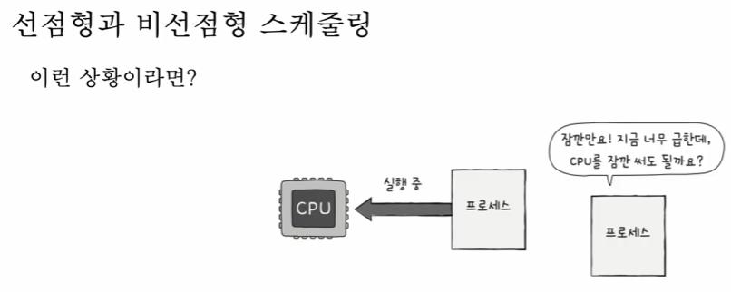

1. 뺏어서 다른 프로세스에 할당 - 선점형

자원독점을 막고, 골고루 분배 가능

자주 바꾸면 비용이 크다

2. 안된다 기다려라 - 비 선점형

오버헤드가 적다
골고루 자원이용이 어렵다

# 11-2 CPU 스케줄링 알고리즘

1. 선입 선처리 FCFS

준비 큐 삽입된 순서대로 처리. 
단점 : 프로세스 대기시간이 매우 길어질 수 있다.

2. 최단 작업 우선 SJF

3. 라운드 로빈 RR
선입선처리 + 타임 슬라이스. 선점형 스케줄링

4. 최소 잔여시간 우선 SRT
최단 작업 우선 + 라운드 로빈
정해진 시간만큼 쓰되, 남은 작업시간이 가장 적은 프로세스 선택

5. 우선순위
프로세스들에 우선순위를 부여하고, 높은애부터 실행
같으면 선입선처리

최단 작업 우선, 최소 작업 시간 이 우선순위의 부분집합이다.

근본적인 문제점 : 기아 현상. 우선순위 높은거만 주구장창 실행
우선순위가 낮다면, 먼저 삽입되었음에도 실행이 연기된다. 

---

해결 방법 : 에이징(aging)

오랫동안 대기한 프로세스의 우선순위를 점차 높인다.

6. 다단계 큐  MultiLevel Queue

우선순위의 발전된 형태
우선순위별로 준비 큐를 여러개 사용하는 방식

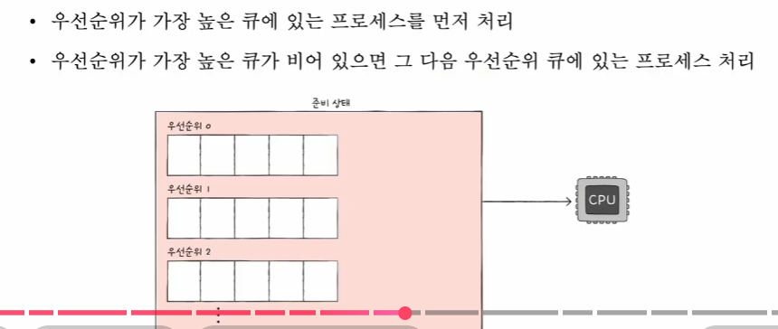

왜 발전된 형태냐

- 단일 큐면 매번 전체를 훑어야함. 다단계는 가장 높은 큐만 검사
- 큐마다 다른 규칙적용 가능

그래도 기아가 발생하긴 한다.

7. 다단계 피드백 큐
다단계 큐의 발전

큐간의 이동이 가능한 다단계 큐

타임 슬라이스동안 못끝내면, 낮은 우선순위 큐로 이동한다.
그러면 자연스럽게 CPU 집중 프로세스 우선순위는 낮아지고, IO집중 프로세스는 상대적으로 높아진다

내가 낸 문제

과거 리눅스는 다단계 큐 등을 활용하여 프로세스 개수(N)와 상관없이 일정한 속도를 내는 $O(1)$ 스케줄러를 사용했습니다. 하지만 최신 리눅스(CFS)는 자료구조를 'Red-Black Tree'로 변경하면서 시간 복잡도가 **$O(\log N)$**으로, 이론상 오히려 더 느려졌습니다.Q. 상식적으로 더 빠른 $O(1)$을 버리고, 굳이 더 느린 $O(\log N)$ 방식을 채택한 결정적인 이유는 무엇일까요? '속도'라는 가치보다 더 중요하게 여겼던 'OS의 덕목'이 무엇이었을지 추론하여 설명해 보세요.

핵심 키워드: 공정성(Fairness), 복잡한 로직(휴리스틱) 제거, 반응성(Responsiveness)상세 해설:'공정성'의 보장:기존 $O(1)$ 방식(다단계 큐 등)은 우선순위를 정하기 위해 프로세스를 분류하는 복잡한 규칙(Heuristic)이 필요했습니다. 이 규칙이 틀리면 특정 프로세스가 부당하게 CPU를 못 받거나, 동영상이 끊기는 등 **불공정함(Unfairness)**이 발생했습니다. 반면, 트리 구조($O(\log N)$)를 쓰면 vruntime(가상 실행 시간)이라는 명확한 수치로 줄을 세워 완벽에 가까운 공정함을 보장할 수 있습니다.속도 차이는 미미함:CPU 성능이 비약적으로 발전하면서, 수천 개의 프로세스 안에서 $\log N$ 정도의 연산 비용은 사용자가 체감하기 힘들 만큼 작아졌습니다. 즉, **"미세한 속도 저하를 감수하고, 확실한 품질(공정성)을 샀다"**고 볼 수 있습니다.코드의 단순화:복잡한 우선순위 조정 로직이나 에이징(Aging) 같은 인위적인 규칙들을 제거하고, 자료구조(트리)의 특성 자체로 스케줄링을 해결하여 커널 코드의 유지보수성을 높였습니다.

---

문제: 과거의 웹 브라우저는 하나의 프로세스 안에서 여러 개의 탭(Tab)을 스레드로 띄워서 관리했습니다. 스레드는 자원을 공유하므로 메모리를 적게 쓰고 가볍기 때문입니다.

하지만 **구글 크롬(Chrome)**은 탭 하나를 띄울 때마다 독립적인 **프로세스(Multi-process)**를 생성하는 방식을 채택했습니다. 프로세스는 스레드보다 메모리도 많이 먹고 생성 비용도 비쌉니다.

Q. 그럼에도 불구하고, 크롬이 메모리 낭비를 감수하면서까지 '멀티 스레드' 대신 '멀티 프로세스' 구조를 채택한 결정적인 이유는 무엇일까요? (힌트: 탭 하나가 먹통이 되었을 때를 상상해 보세요.)

출제자의 힌트:

스레드는 자원(메모리)을 공유합니다. 옆 스레드가 사고를 치면 나한테 어떤 영향이 갈까요?

'안정성(Stability)'과 '보안(Security)' 관점에서 생각해 보세요.

모범 답안:

핵심 키워드: 격리(Isolation), 안정성(Stability)

해설: 멀티 스레드 방식은 하나의 탭(스레드)에서 오류가 발생해 종료되면, 자원을 공유하는 전체 프로세스(모든 탭)가 함께 꺼져버릴 위험이 있습니다. 반면 멀티 프로세스 방식은 각 탭이 완전히 격리되어 있기 때문에, 특정 탭이 응답 없음 상태가 되거나 악성 스크립트에 감염되더라도 브라우저 전체나 다른 탭에는 영향을 주지 않습니다. 즉, '자원 효율성'을 포기하고 '사용자 경험의 안정성'을 구매한 설계입니다.

--
-

[스케줄링] 타임 슬라이스(Time Slice)의 딜레마
문제: 라운드 로빈(Round Robin) 스케줄링에서는 프로세스마다 **타임 슬라이스(Time Slice, CPU 할당 시간)**를 정해두고 돌아가며 실행합니다. 그렇다면 이 타임 슬라이스의 크기는 어떻게 정하는 게 좋을까요?

Q. 타임 슬라이스를 '극단적으로 짧게(예: 0.00001초)' 잡았을 때와 '극단적으로 길게(예: 1시간)' 잡았을 때 각각 발생하는 치명적인 문제점은 무엇일지, '문맥 교환(Context Switch)'과 '반응성(Response Time)'이라는 키워드를 사용하여 설명해 보세요.

출제자의 힌트:

문맥 교환은 공짜가 아닙니다. 짐 싸고 짐 푸는 시간(Overhead)입니다.

여러분이 카톡을 켰는데 1시간 뒤에 창이 뜬다면 어떨까요?

모범 답안:

너무 짧을 때: 프로세스를 실제 실행하는 시간보다 짐을 싸고 푸는 **문맥 교환 오버헤드(Context Switch Overhead)**가 더 커져서, CPU가 일은 안 하고 교체만 하다가 시간을 다 씁니다. (배보다 배꼽이 더 큰 상황)

너무 길 때: 하나의 프로세스가 CPU를 너무 오래 독점하므로, 다른 프로세스들이 오래 기다려야 합니다. 이로 인해 마우스 입력이나 화면 갱신이 늦어지는 등 응답성(Response Time)이 매우 나빠집니다. (사실상 선입선처리 FCFS와 다를 게 없어짐)

---

문제: fork() 시스템 콜은 부모 프로세스의 모든 자원(코드, 데이터, 힙, 스택)을 자식 프로세스에게 복제합니다. 하지만 프로세스가 1GB짜리라면, fork() 할 때마다 1GB를 메모리에 똑같이 복사하는 건 엄청난 시간과 공간 낭비입니다.

심지어 fork() 직후에 exec()를 실행하면 기껏 복사한 메모리를 싹 다 지우고 새 프로그램으로 덮어써 버립니다.

Q. 똑똑한 운영체제는 이 비효율을 막기 위해 '일단 복사한 척'만 하고, 진짜 복사는 최대한 미루는 기법을 사용합니다. 이 기법의 이름은 무엇이며, '언제' 진짜 복사가 일어나는지 설명하세요.

출제자의 힌트:

부모랑 자식이랑 읽기(Read)만 할 때는 굳이 따로 가질 필요가 없죠. 같이 봐도 되니까요.

문제는 누군가 내용을 수정(Write)하려고 할 때 발생합니다.

모범 답안:

기법 이름: Copy on Write (COW, 쓰기 시 복사)

작동 원리: fork() 시점에는 물리 메모리를 복사하지 않고, 부모와 자식이 같은 메모리 공간을 공유(포인터만 연결)하게 합니다. 그러다 둘 중 하나가 메모리에 데이터를 쓰려고(Write) 시도하는 순간, 그때 운영체제가 해당 페이지를 진짜로 복제하여 분리합니다. 이를 통해 불필요한 메모리 복사를 획기적으로 줄입니다.