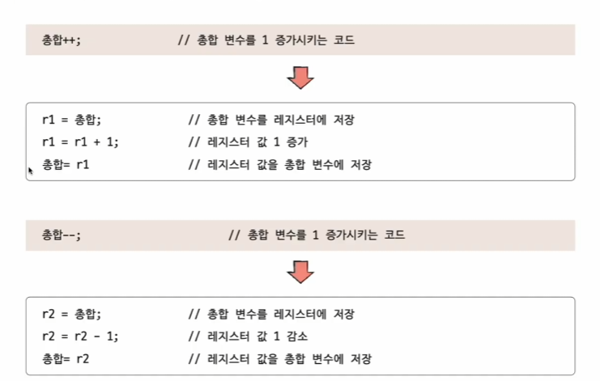
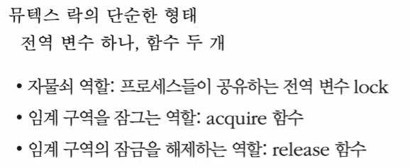
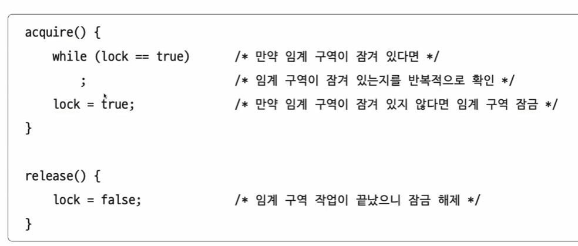
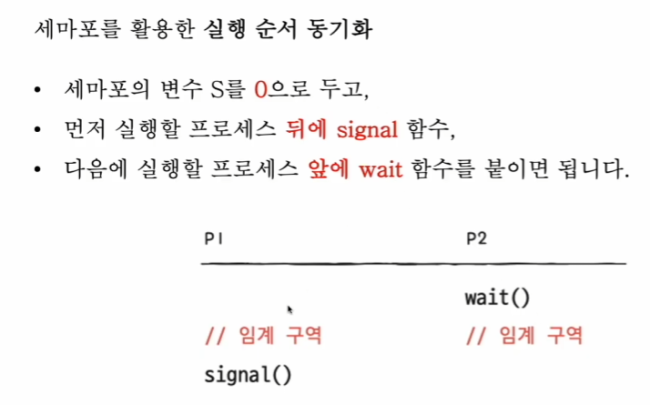
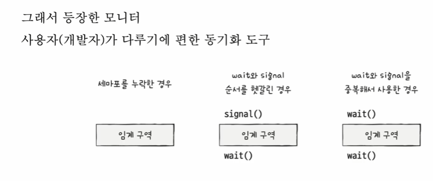
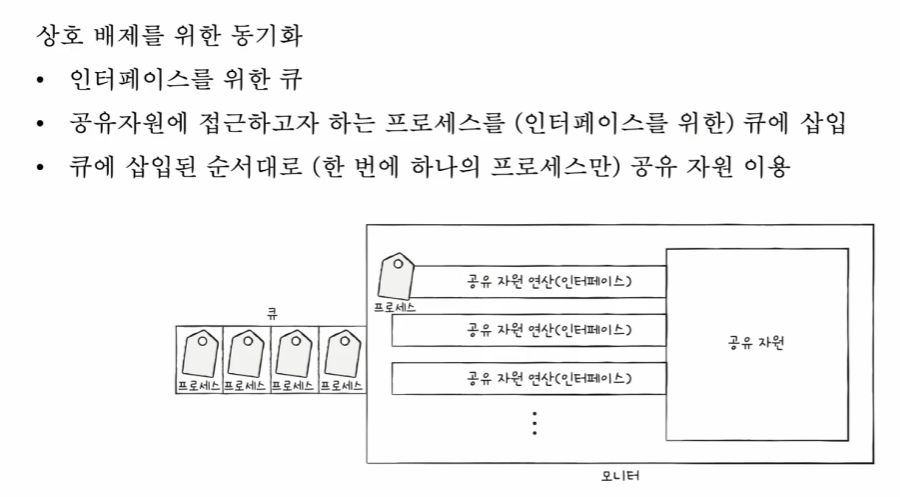
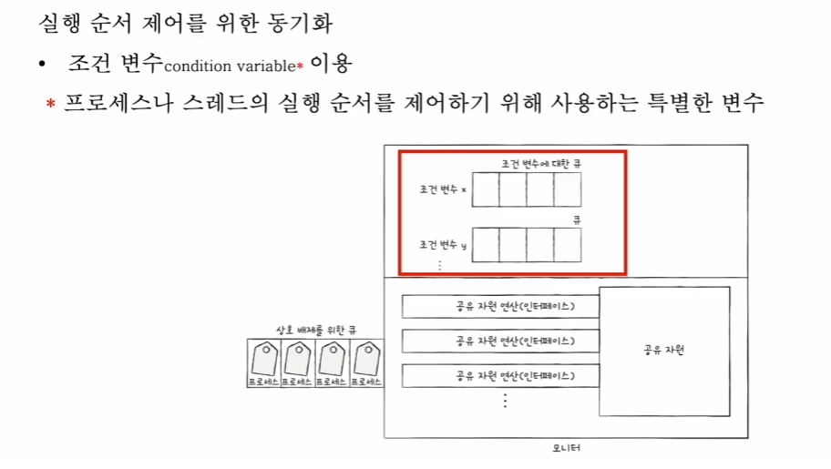
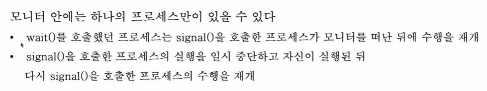
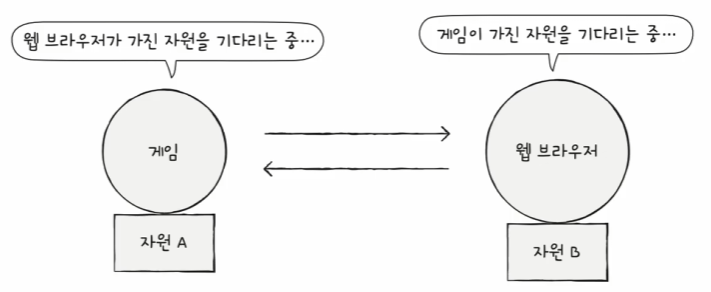
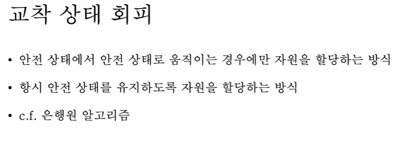

12 동기화

# 12 - 1 동기화란
프로세스들의 수행 시기를 맞추는 것.

실행 순서 제어 : 프로세스를 올바른 순서대로 실행하기

상호배제 : 동시에 접근해서는 안되는 자원에 하나의 프로세스만 접근하게 하기

순서제어를 위한 동기화와 상호배제를 위한 동기화

프로세스 뿐만 아니라 스레드도 동기화의 대상이다.

## 실행 순서 제어를 위한 동기화 : reader writer Problem

Writer : Book.txt 파일에 값을 저장하는 프로세스
Reader : Book.txt 파일에 저장된 값을 읽어들이는 프로세스

Writer가 선행되어야 한다.

## 상호 배제를 위한 동기화 : Bank Account Problem
공유가 불가능한 자원의 동시 사용을 피하기 위한 동기화
프린터라던지, 한번에 하나의 프로세스만 이용 가능하도록 만든 동기화.

한 번에 하나의 프로세스만 접근해야 하는 자원에 대한 동기화.

Producer Consumer Problem : 

물건을 생산하는 생산자와 소비하는 소비자.

"총합" 변수 공유.

---

공유자원 : 여러 프로세스나 스레드가 공유하는 자원

전역변수, 파일, 입출력장치, 보조기억장치

임계 구역 : 동시에 실행하면 문제가 발생하는 자원에 접근하는 코드 영역
"총합" 변수, "잔액" 변수....

임계구역에 진입하고자 하면, 진입한 프로세스 이외는 대기해야 한다.

지키지 못해서 임계 구역에 동시에 접근하면 자원의 일관성이 깨진다 - Race Condition 

고급언어는 실행 시 저급언어로 변환되어 실행된다. 

저급언어로 바뀌면서 여러 줄로 바뀐다. 이때 문맥교환 발생 시 예상치 못한 결과를 보게 되는 것이다. Race Condition이 발생할 수 있다

---

OS 가 상호배제를 위한 동기화를 하는 3가지 원칙 

## 1. 상호 배제
한 프로세스가 임계구역에 진입했다면, 다른 프로세스는 들어올 수 엇ㅂ다.

## 2. 진행
임계구역에 아무도 없으면 진입하고자 하는 프로세스는 진입해야 한다.

## 3. 유한 대기
한 프로세스가 진입하고자 한다면, 언젠가 들어와야 한다.

---

# 12 - 2 동기화 기법

뮤텍스 락, 세마포어, 모니터 - 가장 대중적인 3가지 기법

## 뮤텍스 락
상호배제를 위한 동기화 도구 (자물쇠 역할) 한놈 가고 잠그고 한놈 가고.. / 공유 자원이 하나만 있는 경우.

전역변수 하나와 함수 2개.

자물쇠 변수와 잠그고 푸는 함수 2개.

잠그는거는 while무한루프로 잠겨있나 확인 하고 풀리는 순간 lock=true;

### acquire에서 While 짚고갈 점.

busy waiting - 쉴 새 없이 확인하는게 별로임. 

while(lock==true) 이런거.

## 세마포어

좀 더 일반화된 방식의 동기화 도구. 공유자원이 여러개 있어도 적용 가능.
Binary 세마포어 ( 뮤텍스와 유사)
여기서는 Counting 세마포어

---

세마포 - 열차에 대한 표지판 느낌.
임계구역 앞에서 멈춤신호 받으면 기다리기.  go 받으면 임계구역 진입.

마찬가지로 전역변수 하나, 함수 2개.

전역변수 = 진입할 수 있는 프로세스의 개슈 = 사용가능한 공유자원의 개수. S
Wait
Signal(가도 좋다.)

wait
while(S<=0) 들어갈 수 있으면 들어가라. 

여기서도 Busy Waiting 발생. CPU Cycle 낭비.

실제로는 

사용할 수 있는 자원이 없을 경우 "대기 상태"로 만듦 (해당 프로세스의 PCB를 대기 큐에 삽입)
- 대기상태면 CPU Cycle이 필요없음.
사용할 수 있는 자원이 생겼을 경우 대기 큐의 프로세스를 "준비상태"로 만듦 (해당 프로세스의 PCB를 대기 큐에서 꺼내 준비 큐에 삽입)

한편, signal에서는 S++를 한 다음에, 자고잇던 놈을 깨워줘야 하기때문에 대기큐에서 준비큐로 옮기는게 있다. 

---

### 세마포어를 활용한 실행순서 동기화.

## 모니터

그러나 실행순서 동기화를 위해 세마포어를 쓰면 앞뒤로 명시적으로 호출해야 해서 불편하다.

그래서 등장한 모니터 - Java에서 주로 사용

상호 배제를 위한 동기화와 실행순서 동기화 모두 제공

조건변수마다 큐가 있다. 이걸로 실행 순서를 제어한다.

상호배제를 위한 큐와 조건변수 큐는 다르다.

조건변수는 Wait, signal 가 있다. wait를 하면 대기상태로 변경이 일어나고, 조건 변수에 대한 큐로 삽입한다.
signal을 하면 조건변수를 실행상태로 변경한다.

2가지 방식이 있다. 

하여튼 중요한 점은

모니터는 상호배제와 실행순서 동기화 제공한다.

1. 특정 프로세스가 아직 실행될 조건이 되지 않은 경우, Wait로 실행을 중단한다.
2. 충족 되면 signal로 실행을 재개한다.

---
13 교착상태 - 데드락

식사하는 철학자 문제

# 13 - 1 교착상태란

교착상태를 해결하기 위해서는

1. 교착상태 발생했을때의 상황을 정확하게 표현하기
2. 교착 상태가 일어나는 근본적인 이유 이해하기

자원할당 그래프

- 어떤 프로세스가 어떤 자원을 할당받아 사용중인지 확인 가능
- 어떤 프로세스가 어떤 자원을 기다리고 있는지 확인 가능

## 교착상태가 발생할 조건

1. 상호 배제 : 한 프로세스가 사용하는 자원을 다른 프로세스가 사용할 수 없는 상태
2. 점유와 대기 : 할당받은 상태에서 다른 자원 할당을 기다리는 상태
3. 비선점 : 어떤 프로세스도 다른 프로세스의 자원을 강제로 빼앗지 못하는 상태
4. 원형 대기 : 프로세스들이 원의 형태로 자원을 대기하는 상태(자원할당그래프에서 원의 형태로 싸이클)

모두 만족하면 교착상태가 발생할 수 있음
하나라도 만족 하지 않으면 교착상태가 발생하지 않음

# 13 - 2 교착상태 해결 방법

예방, 회피, 검출 후 회복

## 예방
교착상태 발생조건, 상호배제, 점유와 대기, 비선점, 원형대기 중 하나 없애기 (상점비원)

상호배제 없애면? - 모든 자원을 공유 가능하게 만들기. 사실상 불가능
점유와 대기 없애면? - 특정 프로세스에 자원 몰빵, 하거나 아무것도 안주거나.  - 자원 활용률을 낮춘다.
비선점 없애면? - 선점이 가능한 자원(CPU라던지)에 한해 효과적 - 모든 자원이 선점 가능한 것은 아니다. 예를들어 프린터
원형대기 없애면? - 모든 자원에 번호 붙이고, 오름차순으로 할당한다던지. 싸이클의 방지. - 자원에 번호 붙이는 것은 어려운 작업이다. 어떤 자원에 어떤 번호를 붙이느냐에 따라 활용률이 달라진다. 

요약 : 교착 X는 보장 가능. 부작용 발생

## 회피
교착 상태는 "무분별한 자원 할당으로 발생" 했다고 간주
조심조심 할당하기

교착상태가 발생하지 않을 만큼만 자원 배분

1. 안전 순서열
교착 없이 안전하게 프로세스에 자원을 할당할 수 있는 순서

2. 안전상태
교착상태 없이 모든 프로세스가 자원을 할당 받고 종료 될 수 있는 상태

3. 불안전 상태
교착 상태가 발생할 수도 있는 상태

ex)
컴퓨터에 12개의 자원
프로세스 P1,P2,P3가 5,2,2개의 자워을 할당받아 실행중
운영체제가 배분할 수 있는 자원의 개수는 3개

또 10,4,9를 요구한다고 침. 

안전 순서열이 존재. P2-P1-P3

항상 안전한 상태로 가자. 

은행원 알고리즘(예시)

## 검출 후 회복

선점을 통한 회복, 프로세스 강제 종료를 통한 회복

선점을 통한 회복, 교착상태 해결될때까지 몰빵

강제종료 - 프로세스 모두 강종하는 방식(작업 내역을 잃을 위험), 하나씩 강제종료(오버헤드) 

질문

Q1. 뮤텍스와 세마포어의 차이점이 뭘까

Q1 해설: 가장 큰 차이는 동기화 대상의 개수와 소유권입니다.

뮤텍스: 자원이 1개일 때 사용(Binary Semaphore). Lock을 건 놈만 Lock을 풀 수 있습니다(소유권 있음).

세마포어: 자원이 n개일 때 사용(Counting Semaphore). Lock을 걸지 않은 다른 프로세스가 Signal을 보내 Lock을 해제할 수도 있습니다(소유권 없음).

Q2. 'Busy Waiting'이란 무엇이며, 운영체제는 이를 해결하기 위해 어떤 기법을 사용하나요? (세마포어의 구현 방식과 연관 지어 설명)

Busy Waiting: 자원을 얻을 때까지 while 루프를 계속 돌며 CPU 자원을 소모하는 현상입니다.

해결: OS는 자원이 없으면 해당 프로세스의 PCB를 **'대기 큐(Waiting Queue)'**로 보내 CPU를 쓰지 않게 재우고, 자원이 반납(signal)되면 다시 **'준비 큐(Ready Queue)'**로 옮겨 실행시킵니다.

---

. 교착상태(Deadlock) 해결 방법 중 '회피(Avoidance)' 기법인 은행원 알고리즘(Banker's Algorithm)의 핵심 아이디어는 무엇인가요?

시스템을 **안전 상태(Safe State)**와 **불안전 상태(Unsafe State)**로 나누고, 자원을 할당했을 때 '안전 상태'가 유지되는 경우에만 자원을 할당하는 방식입니다.

---

컨테이너 환경에 대한 질문.

컨테이너에는 guestOs가 없다. 컨테이너가 시스템콜을 어떻게 처리하는가.

-> 그대로 Host OS가 처리한다.

그렇다면 윈도우 호스트에서 컨테이너 내부의 리눅스가 호출하는 시스템콜을 어떻게 처리하는지 답해봐라.
가능하다면 WSL1과 WSL2에서 어떻게 처리하는지.

->

그렇다면 리눅스 호스트에서 윈도우 컨테이너 시스템콜을 처리할 수 있겠는가. 아니면 이유도 답하라
->

---

모니터를 이용한 프로세스 순서 제어에서, 조건 변수의 signal()이 호출되었을 때 왜 해당 프로세스를 즉시 실행시키지 않고 준비(대기) 큐로 이동킬까요?

-> 비선점, 그리고 모니터에는 하나의 프로세스만 가능.

모범 답 : 다시 돌아간 프로세스나 스레드가 그거보다 높은 우선순위를 가진 프로세스나 스레드 있을 수 잇기때문에 다시 원래대로 하는거임.

교착 상태를 해결하기 위해 검출 후 회복 방식을 사용했고, 교착 상태가 없어질 때까지 프로세스를 하나씩 종료하고 있다. 이 때 프로세스 하나가 종료된 직후에 운영체제가 수행해야 하는 작업과 발생할 수 있는 문제점은?

busy waiting 방식과 blocking 방식 중 무조건 blocking이 더 효율적인 것 같은데 busy waiting을 쓰는게 효율적인 경우가 있다. 어떤 경우일까?
-> 블로킹은 컨텍스트 스위칭, BusyWaiting은 작업이 빨리 끝나는 경우 그대로CPU에 잇응니까 좋음.

---

LiveLock = 계속 충돌을 피하기위해 재시도, 양보 하는데 양보만 하다가 아무도 임계구역에 못들어가는 상황.데드락과의 차이. 
해결하고자 한다면 어캐 할지.
-> 데드락은 개별 프로세스도 멈추고 작업 진도도 멈춤. 라이브락은 개별 프로세스가 뭘 하긴 하는데 전체 작업도 멈춤
해결하고자 한다면 어느 한놈은 절대 양보 안하도록

동시성 문제 중 경쟁 상태를 해결하려면 무엇이 보장되어야 하나요?
-> 원자성, 가시성(한 스레드가 변경한 값을 다른 스레드가 볼 수 있어야 한다)

개발자가 경쟁상태를 막기위해 락을 채운다. 락을 너무 많아져서 교착상태가 된다.

---

- 모니터의 구성 요소에 대해 설명하시고, 조건 변수 큐에 들어갈지 판단하는 타이밍과 조건 변수 큐에서 signal을 통해 깨어난 프로세스는 어떻게 되는 지 설명하시오.

->

조건변수의 사용의 주 목적, 공유자원 A를 위한 스레드 100개가 모니터 큐에 들어갔다. A를 사용했을 때 작업이 이뤄지는 방식. 
-> 조건변수 사용은 스레드 실행순서 제어를 위한 것. 

교착상태 발생조건에 대해 설명하시고, 교착 상태 회피에 대해 설명하시오
-> 4가지 조건과 은행원알고리즘, 안전상태를 유지하는 형식으로.

교착 상태 검출 후 회복 기법 중 타조 알고리즘이라는 것이 있다. 타조 알고리즘은 문제를 무시하는 방식이다. 이 타조 알고리즘은 어떤 경우에 사용될까?
-> 교착상태가 잘 안일어나고, 오히려 해결하려는 시도가 더 많이 드는 경우.
모범 답 - > 문제가 큰 문제가 아니라서 무시.

---

세마포어에서 접근가능자원이 1개랑 ,뮤텍스랑 무슨 차이가 있냐
-> 뮤텍스는 락을 획득한 주체만 해결가능, 세마포어는 다른 프로세스는 ..

뮤텍스는 무조건 락을 획득한 애가 풀어야 하는데, 세마포어는 A가 잡고  B가 Signal을 해도 된다.그래서 모니터에서 signal 꼬이면 문제가 생긴다. 

그리고 세마포어 카운팅 하는게 동시에 3명이 접근가능한다 이건지, 3개의 자원인지

정확히는 같은 3개의 자원을 하나씩 맡는다?

잘 못알아들음.
