# 14 메모리

# 14-1 연속 메모리 할당

프로세스에 연속적으로 메모리 공간을 할당

## 스와핑

현재 사용되지 않는 프로세스들을 보조기억장치의 일부 영역(스왑영역)으로 쫓아내고, 빈 공간에 새 프로세스 적재

스왑 인 - 보조기억장치에서 메모리로
스왑 아웃 - 반대

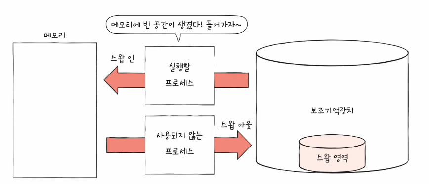

스와핑 왜 하냐
-> 프로세스들이 요구하는 메모리 공간 크기 > 실제 메모리 크기.
신용 끌어다 대출하는 느낌.

스왑영역 크기 확인 : free, top명령어

근데 어디다 할당하냐 가 문제.

## 1. 최초 적합

주소 첨부터 보다가 넣을수 있으면 넣기

검색 최소화, 빠른 할당

## 2. 최적 적합,

모두 검색 해보고, 최적인곳에 넣기

## 3. 최악 적합

모두 검색해보고, 적재 가능한 가장 큰 공간에 할당

---

이러한 연속적 메모리 할당 방법들은 '외부 단편화'를 초래한다.

## 외부 단편화
프로세스들이 실행되고 종료되길 반복하며, 메모리 사이사이에 빈 공간 발생

### 외부 단결화 해결 1 - 메모리 압축

빈 공간들을 재배치 , 많은 오버헤드, 프로세스도 자기 일을 못함

### 외부 단편화 해결 2- 페이징
14-2로.

# 14-2 페이징을 통한 가상메모리 관리
연속 메모리 할당의 2가지 문제

1. 외부단편화
2. 물리 메모리보다 큰 프로세스 실행 불가

가상메모리 - 프로그램이 요구하는 메모리 일부를 보조기억장치로 대체

페이징 말고도 세그멘테이션이 있는데, 이 책에서는 페이징만 다룬다. 세그멘테이션은 잘 안쓴다.

*** 질문 : 세그멘테이션이 뭘까요

---
## 페이징이란

외부 단편화 근본 문제 : 각기 다른 크기의 프로세스가 메모리에 연속적으로 할당되었기 때문.

할당 자체를 일정한 크기의 Page로 하자. 불연속적으로 할당.  이런 느낌

정의 : 프로세스의 논리 주소공간을 Page라는 일정 단위로 자르고, 
메모리의 물리주소 공간을 Frame이라는 페이지와 같은 크기 단위로 자르고
페이지를 프레임에 할당하는 가상 메모리 관리 기법

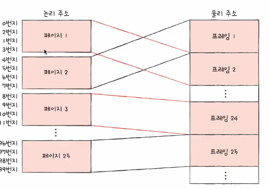

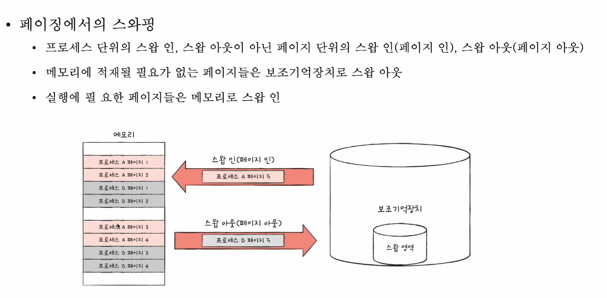

프로세스에서 모든 페이지가 메모리에 적재될 필요가 없기 때문.

근데 불연속적으로 할당하면, 물리 주소가 뭔지 어캐 아냐?

## 페이지 테이블
페이지 번호와 프레임 번호를 짝지어주는 일종의 이정표

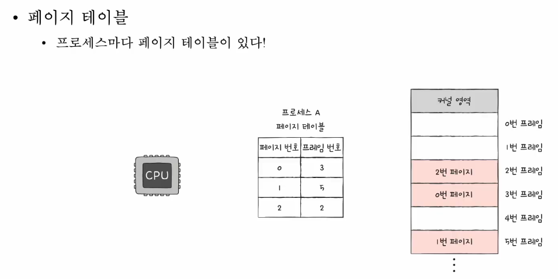

프로세스마다 페이지 테이블이 있다.

CPU는 그저 논리주소를 순차적으로 실행하면 된다.

## 페이징의 단점 : 내부 단편화

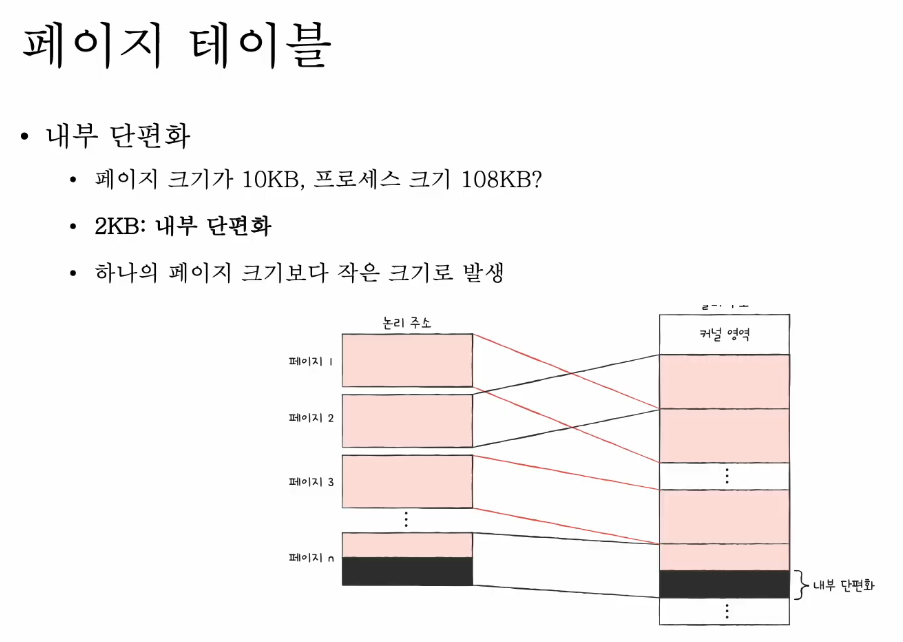

페이지 내부에서 4KB라고 치면, 3KB가 마지막이라 1KB가 남는다.

근데 그럼에도 외부단편화보다 적다.

## PTBR(프로세스 테이블 베이스 레지스터)

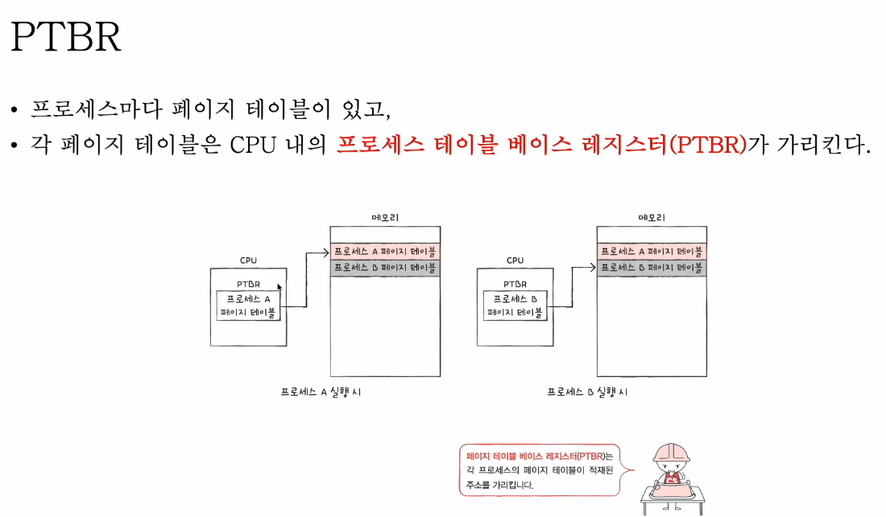

프로세스마다 페이지 테이블이 있고,
각 페이지 테이블은 CPU내부의 프로세스 테이블 베이스 레지스터가 가리킨다. 

### PTBR이 가리키는 페이지 테이블의 위치 문제
만약 페이지 테이블이 메모리에 있다면, 특정 메모리에 접근할 때 PTBR로 PT 접근. 이후 PT로 메모리 접근, 그래서 프로세스에서 메모리 접근 비용이 2배가 된다.

그렇기 때문에...

## TLB
CPU곁에 페이지 테이블의 캐시 메모리. 페이지 테이블의 일부를 가져와 전달.

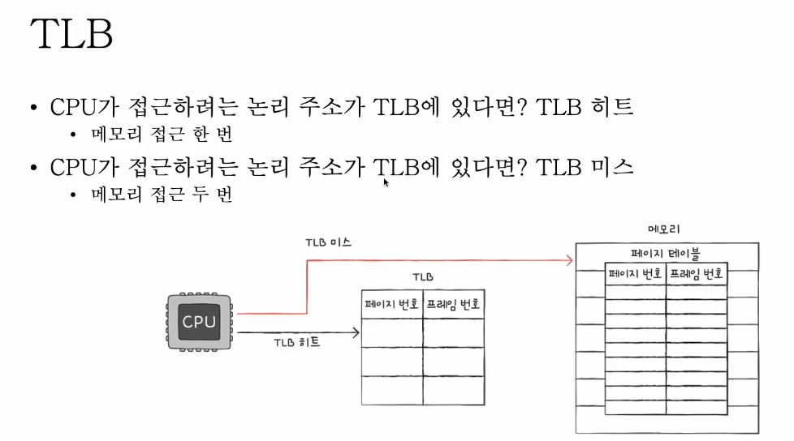

## 접근 과정

페이징 시스템에서 논리 주소는 [페이지 번호 : 변위] 로 구성되어있다.즉, 논리적 주소와 offset
페이지 테이블을 통해 [프레임 번호, 변위]로 변환된다. 

한편 두 변위는 같다.페이지와 프레임 크기가 같은게 페이지네이션이니까.

## PTE
페이지 테이블의 각 레코드를 페이지테이블 엔트리 라고 한다. 페이지테이블 엔트리PTE는 [페이지 번호:프레임번호] 로 구성된다.이게 기본이고..

### 유효비트
0인 페이지 접근시도 시. 페이지폴트. 디스크 가서 페이지 갖고와라.

### 보호비트
페이지 보호 기능을 위해 존재한다. 쓰기 권한이 없으면 0

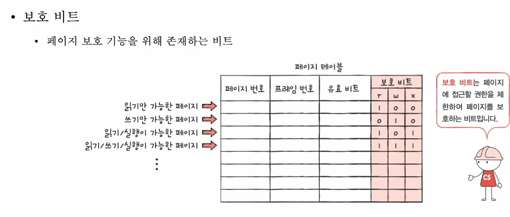

### 참조 비트
CPU가 이 페이지에 접근한 적이 있는지 여부

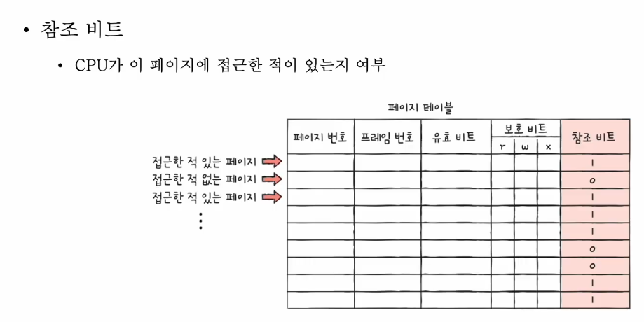

### 수정비트
cpu가 이 페이지에 데이터를 쓴 적이 있는지 여부. 

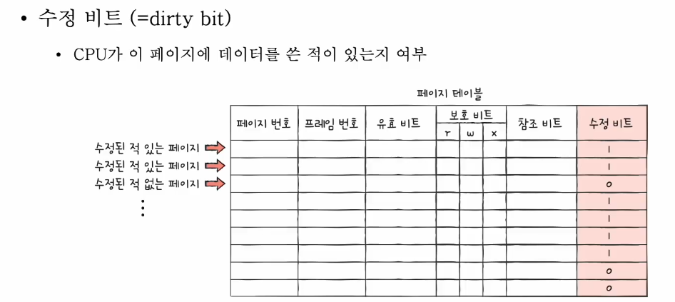

수정비트 존재 이유 : 스와핑 관련. 보조기억장치에 반영 해야되면 수정비트가 1일거다.

# 14- 추가 페이징의 장점: 외부단편화 해결 이외에 Copy on write

프로세스 복사 시 fork하면 메모리 그대로 복붙해야 하는 문제가 있었다.
부모페이지 할당된 프레임과 자식은 다르니까.

쓰기 시 복사가 되면. 자식 프로세스는 부모 프로세스와 동일한 프레임을 가리킴.
쓰기가 진행이 되면, 해당 페이지는 별도의 공간으로 복제.

## 계층적 페이징

프로세스 테이블의 크기는 생각보다 크다.
모든 PTE 를 메모리에 두는것은 낭비.
이런 관점에서 나왔다.

페이지 테이블을 페이징하여, 여러 단계의 페이지 페이지를 두는 방식.

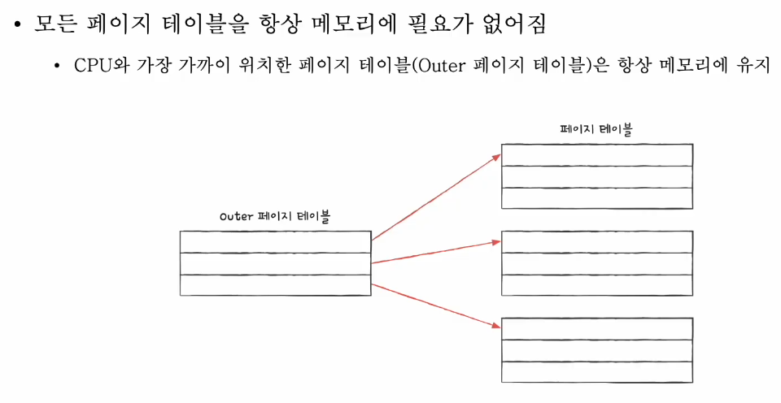

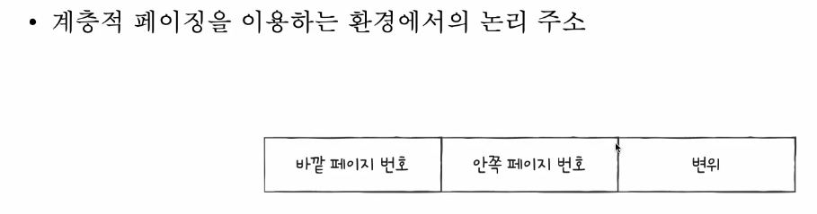

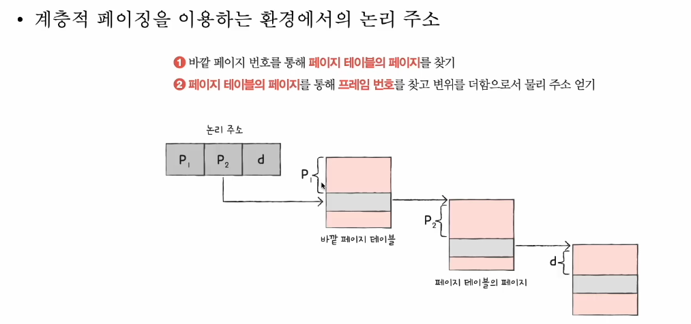

n단계까지 확장 가능

# 14-3 페이지 교체와 프레임 할당

페이징으로 물리메모리보다 큰 프로세스를 실행할 수 있지만,

그럼에도 물리메모리는 고정크기다.

기존 적재된 불필요한 페이지를 디스크로 보내고, 프로세스에게 적절한 수의 프레임을 할당해야 한다.

전자가 페이지 교체, 후자가 프레임 할당

## 요구 페이징
필요한 페이지만을 메모리에 적재한다.

과정
1. CPU가 특정 페이지에 접근하는 명령어를 실행한다.
2. 해당 페이지가 현재 메모리에 있을 경우(유효비트 1)  CPU는 페이지가 적재된 프레임에 접근한다.
3. 유효비트가 0인 경우, 페이지 폴트 발생.
4. 페이지 폴트 처리 루틴은 해당 페이지를 메모리로 적재하고 유효비트를 1로 설정

## 요구페이징 - 해결 문제

### 페이지 교체
요구로 하면, 언젠가 메모리가 가득 찬다. -> 페이지 교체 알고리즘

기준 : 뭐가 좋은 페이지 교체 알고리즘인가.

1. 페이지 폴트가 적은 알고리즘. -> 디스크 접근 감소

페이지 폴트 횟수는 어캐 알까 - 페이지 참조열(CPU가 참조하는 페이지들중 연속된 페이지를 생략한 페이지열) -> 연속이면 폴트 없으니까.

#### FIFO 교체 알고리즘
고인물 나가라. 단점 -> 고인물인데 일 잘하는놈도 내쫒음.

보완책. 2차 기회 페이지 교체 알고리즘
참조비트1 : 한 번 참조한 적 있는 페이지. 0 : 참조한 적 없는 페이지.
1이면 기회 한번 더 주기.

#### 최적 페이지 교체 알고리즘

미래를 봤을때 가장 오랫동안 안쓰는놈 나가
구현이 어렵다. 미래를 어떻게 보는데 -> 다른 알고리즘 성능 척도.

#### LRU 페이지 교체 알고리즘.
과거를 보고 안쓰는놈 나가.

---

### 프레임 할당
페이지 폴트가 자주 발생하는 이유 -> 프로세스가 사용할 수 있는 프레임 자체가 적어서일거다 ! ( 페이지 교체-나쁜 페이지 교체 알고리즘을 사용해서)

#### 스레싱
프로세스가 실행되는 시간보다 페이징에 더 많은 시간을 소요하여, 성능이 저해되는 문제
(오버헤드가 너무 큰 문제)

멀티 프로그래밍 정도가 커진다고 CPU이용률이 계속 느는게 아니다. 

스레싱 발생 이유 : 각 프로세스가 필요로 하는 최소한의 프레임 수가 보장되지 않았기 때문.

##### 1. 균등 할당 (정적 할당)
공산주의

##### 2. 비례할당 (정적 할당)
크기에 비례하여 프레임 할당

한계 : 실제로 실행해 봐야 프레임 필요수를 알수도 있다. 크기가 큰데 막상 돌려보니 프레임 필요 수가 적을수도 있다.

##### 3. 작업 집합 모델
프로세스가 실행하는 과정에서 배분할 프레임 결정

CPU가 특정 시간동안 주로 참조한 페이지 개수만큼만 프레임을 할당.
작업집합 = 실행중인 프로세스가 일정시간동안 참조한 페이지의 집합

작업집합을 구하려면? 

1. 프로세스가 참조한 페이지
2. 시간간격이 필요

##### 4. 페이지 폴트 빈도

프로세스가 실행하는 과정에서 배분할 프레임 결정

1. 폴트율이 높으면, 프로세스는 너무 적은 프레임을 갖고있다.
2. 폴트율이 낮으면, 너무 많은 프레임을 갖고있다

라는 2개의 가정.

# 15-1 파일과 디렉터리

파일과 디렉터리를 관리하는 운영체제 내의 프로그램

보조기억장치의 데이터 덩어리인 파일과 디렉토리

## 파일
보조기억장치에 저장된 관련 정보의 집합
의미 있고 관련 있는 정보를 모은 논리적 단위

### 파일 구성요소
파일 자체의 정보
부가정보=속성, 메타데이터

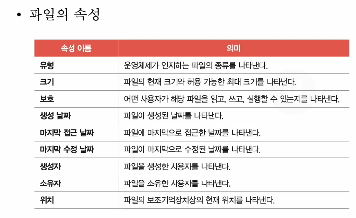

유형 - 확장자.

파일 연산을 위한 시스템 콜

1. 파일 생성
2. 삭제
3. 열기
4. 닫기
5. 쓰기
6. 읽기

등

## 디렉토리
윈도우에선 폴더

1단계 디렉터리 

트리구조의 디렉터리.

최상단 / 
윈도우는 C:W으로 표현.

절대경로 : 루트에서 나 까지 고유경로
상대경로 : 현재 디렉토리에서 나까지 경로

디렉토리도 마찬가지로 시스템 콜.

디렉토리는 - 특별한 형태의 파일

해당 디렉터리에 담긴 대상과 관련된 정보

보통 테이블의 형태로 구성됨.

-디렉터리 엔트리

대상의이름:저장된위치(를 유추할 수 있는 정보)

파일 속성을 명시하는 경우도 있다.

# 15-2 파일시스템

파일과 디렉터리를 보조기억장치에 할당하고 접근하는 방법

파티셔닝, 포매팅 하기 전까지는 SSD를 사용할 수 없다.

## 파티셔닝
저장장치의 논리적인 영역을 구획하는 작업

## 포매팅
파일 시스템을 설정
어떤 방식으로 파일을 관리할지 결정, 새로운 데이터를 쓸 준비하는 작업

파일시스템엔 종류가 여럿. 파티션마다 다른 파일시스템을 설정할 수 있다.

포매팅까지 해서 파일시스템을 설정했다면 파일, 디렉토리 생성 가능.

## 파일 할당 방법
포매팅까지 끝난 하드 디스크에 파일을 저장하기 
운영체제는 파일/디렉터리를 블록 단위로 읽고 쓴다. 
즉, 하나의 파일이 보조기억장치에 저장될 대는 여러 블록에 나누어 저장된다.

HDD의 가장 작은 저장단위는 섹터지만, 보통 블록단위로 읽고쓴다.
 

###  파일을 보조기억장치에 할당하는 2중 하나 `연속할당`

보조기억장치 내 연속적인 블록에 파일 할당
파일이름, 첫번째 블록 주소와 블록단위 길이만 알면 된다.

외부단편화 야기 - 요즘 잘 안씀

### 불연속할당

#### 불연속할당-연결할당

포인터 연결리스트처럼, 각 블록 일부에 다음블록의 주소를 저장.  흩어져있어도 무방

파일이름, 첫번째 블록주소, 블록단위의길이만 알면 된다.

단점 : 반드시 첫번째 블록부터 읽어들여야 한다.
오류 발생시 해당 블록 이후 블록은 접근이 어렵다.

#### 불연속할당- 색인할당

파일의 모든 블록주소를 색인블록 이라는 하나의 블록에 모아 관리하는 방식
파일 내 임의의 위치에 접근하기 용이

디렉터리 엔트리 : 파일이름 & 색인 블록 주소

---

## FAT파일시스템
연결 할당기반 파일시스템
연결 할당의 단점을 보완

근본 연결할당 단점 원인 : 연결리스트

FAT
각 블록에 포함된 다음 블록주소를 한데모아 테이블로 관리

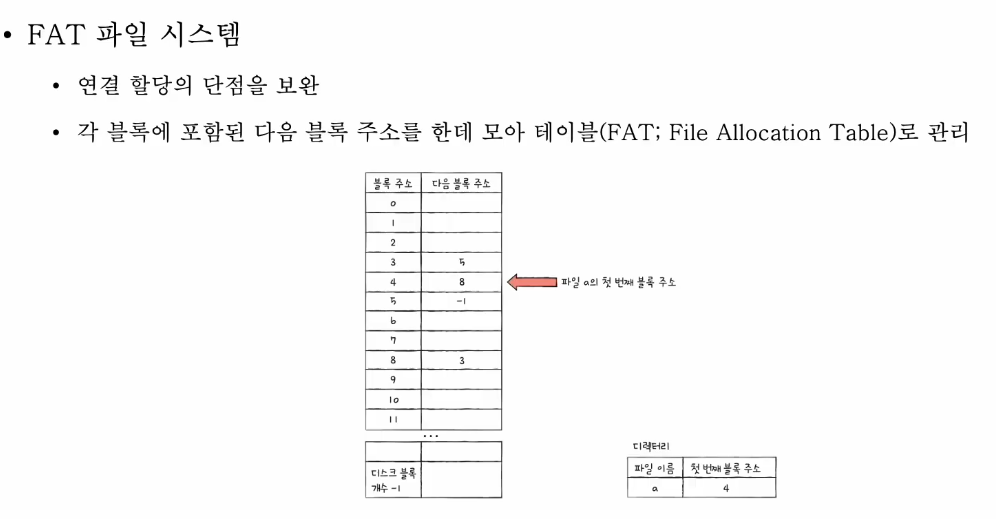

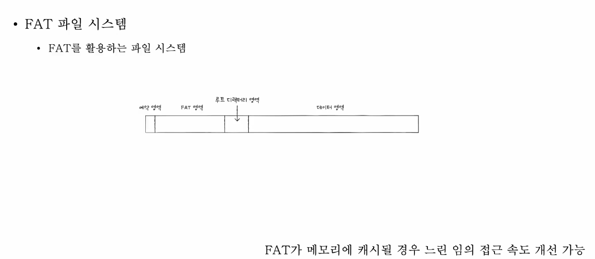

FAT가 메모리에 캐시될 경우, 느린 임의접근 속도 개선 가능

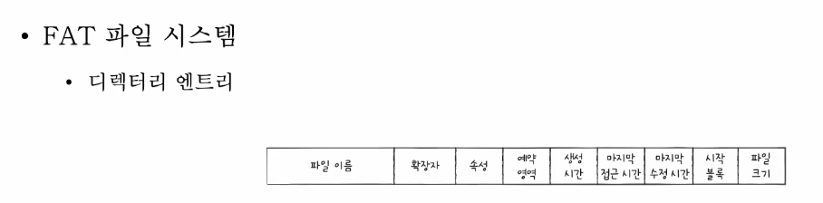

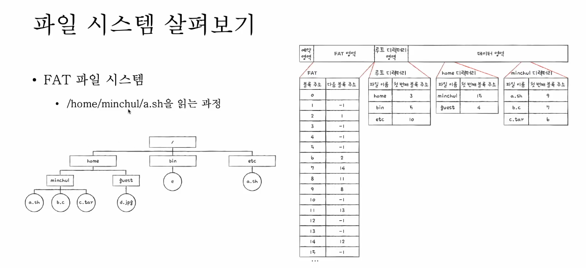

## 유닉스 파일시스템

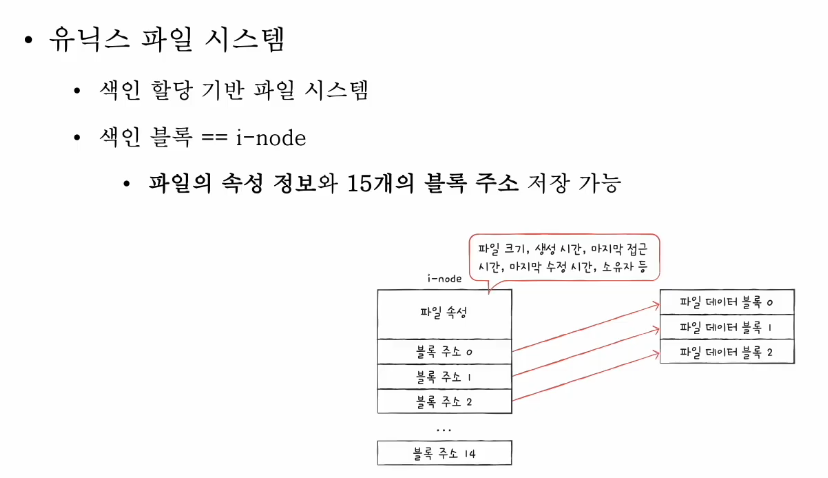

색인할당기반
색인 블록 = i-node

파일의 속성정보와 15개의 주소정보 저장 가능

왜 15개? 더 크면?? 

1. 블록주소 12개에는 직접 블록주소 저장
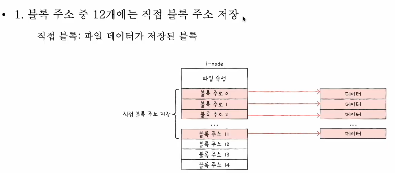

2. 1번으로 모자라면 13번째 주소에 단일 간접 블록주소 저장 
단일간접블록 : 파일 데이터를 저장한 블록주소가 저장된 블록
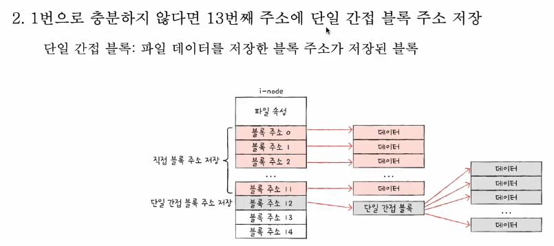

3. 2번으로 모자라면 14번째 주소에 이중 간접 블록주소 저장
이중 간접 블록 : 단일 간접 블록들의 주소를 저장하는 블록
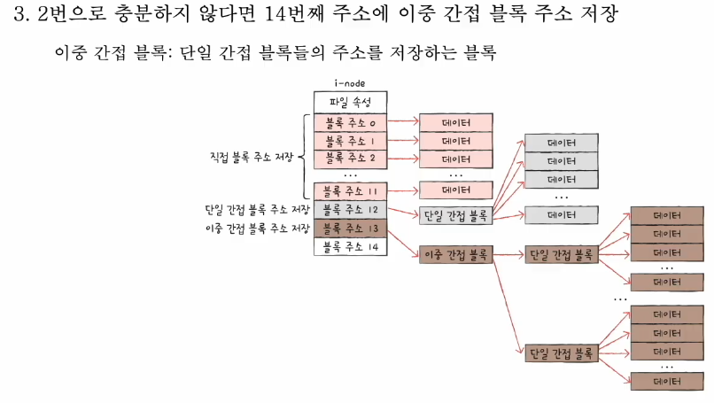

4.3번으로 모자라면 15번째 주소에 삼중간접블록주소 저장
삼중간접블록 : 이중 간접 블록들의 주소를 저장하는 블록
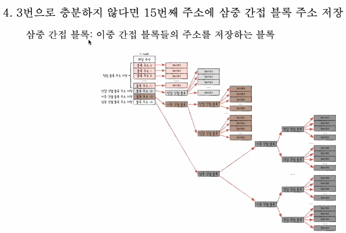

유닉스 파일시스템의 디렉토리 엔트리
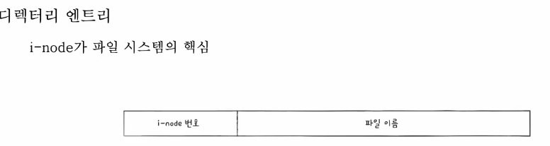

유닉스 파일시스템 읽는 과정

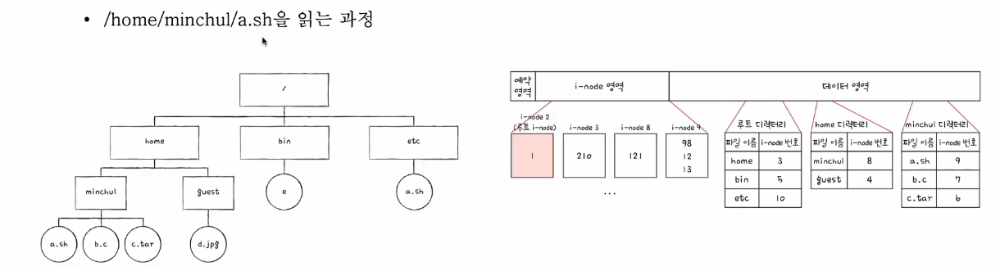

