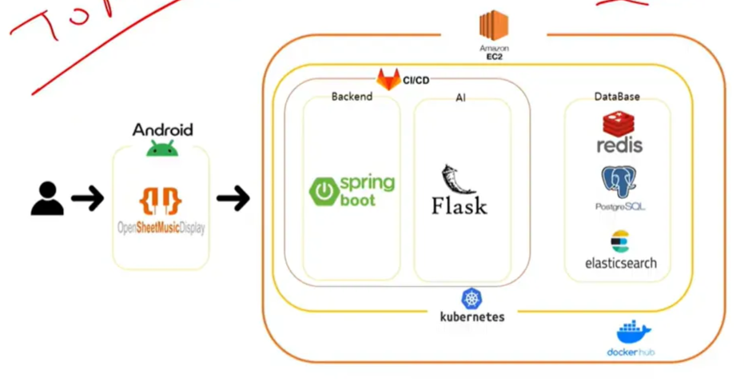
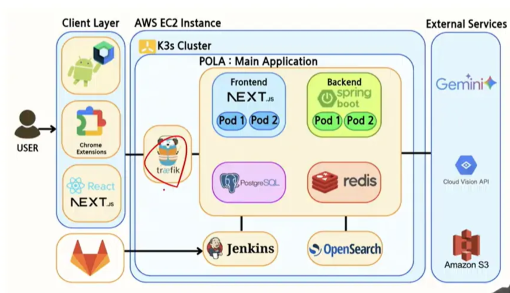
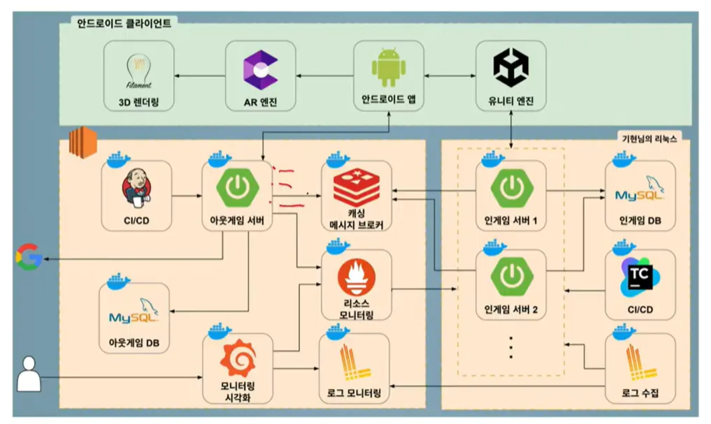

# 오늘 배운 것
# [TIL] 포트폴리오 아키텍처 다이어그램, 80%가 틀리는 이유

포트폴리오에서 아키텍처 다이어그램은 첫인상을 결정짓는 중요한 요소다. 하지만 약 70~80%의 지원자가 아키텍처를 잘못 그리고 있다는 피드백을 받았다. 단순히 예쁘게 그리는 것이 아니라, '설계'가 보여야 한다.

## 1. 흔한 실수: 아키텍처가 아니라 '기술 스택' 나열이다
많은 사람들이 아키텍처 설계도에 로고(Logo)만 잔뜩 배치한다.

> "스프링, 파이썬 쓴 건 아무도 안 궁금해한다. 이건 그냥 기술 스택을 보여주는 것이지, 아키텍처(구조)를 보여주는 게 아니다."

가장 큰 문제점은 **릴레이션(Relation, 관계)**이 빠져 있다는 점이다. 각 요소가 어떻게 연결되고 상호작용하는지 보여주지 않으면 의미가 없다.

## 2. 사례별 피드백

### Case 1: 가독성을 해치는 3D 디자인

* **피드백:** "무난한 포트폴리오 같지만, 3D로 그려서 가독성이 매우 떨어진다."
* **문제점:** 있어 보이게 그리려고 3D(아이소메트릭) 방식을 썼지만, 오히려 구조가 한눈에 들어오지 않는다. 아키텍처는 직관성이 생명이다.

### Case 2: 의도는 좋으나 'How'가 빠진 설계

* **피드백:** "위보다는 낫지만 여전히 아쉬운 버전이다. 스케일링을 통해 가용성 설계를 지향한 건 알겠으나, **'어떻게(How)'** 돌아가는지가 보이지 않는다."
* **문제점:**
    * 여전히 기술 스택(로고) 전시에 집중된 느낌이다.
    * 각 인스턴스에 대한 구체적인 설명이 부족하다.
    * 구조는 갖췄으나 실제 데이터가 어떻게 흐르고 시스템이 작동하는지 논리가 부족하다.

### Case 3: 잘 그려진 아키텍처의 예

* **피드백:** "잘 그려진 버전이다. 단방향, 양방향 흐름이 명확히 보인다."
* **좋은 점:**
    * **릴레이션(관계):** 화살표를 통해 데이터의 흐름(단방향/양방향)을 명확히 표현했다.
    * **구조화:** Client Layer, EC2 Instance, External Services 등 영역이 명확히 구분되어 있다.
    * 기술 스택이 메인이 아니라, **구조와 흐름**이 메인이 되었다.

## 3. 결론: 아키텍처 그리기 전 필수 단계

아키텍처를 그리기 전에 반드시 선행되어야 할 것이 있다.

### ✅ 유저 플로우(User Flow)가 먼저다!
> "아키텍처를 그리기 전에 해야 할 일: **유저 플로우**"

1.  사용자가 우리 서비스를 어떻게 이용하는지 흐름(User Flow)을 먼저 정의한다.
2.  그 흐름이 나온 상태에서 이를 뒷받침할 기술 구조(아키텍처)를 설계해야 한다.
3.  아키텍처 다이어그램은 기술 자랑이 아니라, **데이터와 로직의 흐름을 보여주는 지도**여야 한다.

---
*참고: SSAFY 라이브러리 특강 피드백 요약*

---

### 내일 할 일

설계 작업하기
