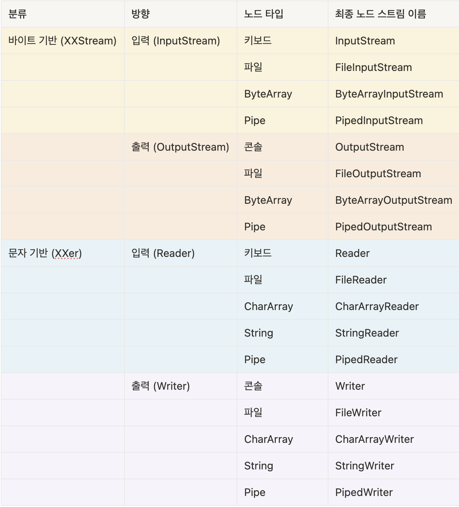

# 오늘 배운 것

## 데이터의 형태
- csv : comma separated value
- xml : 태그를 통해 데이터 형식 정의
    - 정확한 문법을 지켜야 동작 -> valid
        - 문서의 구조, 적절한 요소, 속성들의 개수, 순서들이 잘 지켜져야함
    - `<?xml version=”1.0” encoding=”UTF-8”?>`로 반드시 시작
    - 루트 엘리먼트가 존재하고 나머지 태그들은 트리 형태로 구성
    - 시작 태그와 종료 태그가 일치해야 함
    - 시작 태그는 key-value 구조의 속성을 가질 수 있다.
    - 태그는 대소문자를 구별한다.
- json : javascript object notation을 통해 데이터 형식 정의

## parser

### SAX parser
    - Simple API for XML parser
    - 문서를 읽으면서 태그의 시작, 종료 등 이벤트 기반으로 처리
    - 빠르지만 다양한 탐색이 어려움
    - DefaultHandler를 상속받은 후 재정의하여 parse 사용
    - 읽은 내용을 비교하여 원하는 내용을 parse

### DOM parser
    - Document Object Model parser
    - 문서를 다 읽고 난 후 문서 구조 전체를 자료구조에 저장하여 탐색하는 방식
    - 느리고 무거워서 큰 문서를 처리하기는 어렵지만 다양한 탐색이 가능함
    - DOM Tree
        - 문서를 구성하는 모든 요소를 Node(태그, 속성, 값)로 구성
        - 태그들은 root 노드를 시작으로 부모-자식 관계 구성
    - `DocumentBuilderFactory`로 문서를 로딩 후 Document 함수로 루트 element가져와서 parse
    - 필요한 자식들을 돌면서 찾는 느낌
    - SAX parser에 비해 함수를 활용하여 원하는 데이터를 parse

## DTO
- 계층 간 데이터 교환을 위해 사용되는 객체
- 작성 방법
    - 필요한 속성에 대해 private하게 선언
    - Getter/Setter로 encapsulation
    - Default constructor
    - 필요에따라 toString(), hashCode(), equals() 재정의
    - 데이터 변환 로직(String -> Data 등)

## record
- 데이터를 보관하는데 사용되는 불변 객체를 간단하고 명료하게 정의가능
- 특징
    - 불변성
        - 객체의 상태를 객체 생성 시 정의되며 이후 변경 불가
        - 모든 field가 final
    - 간결성
        - 변수 선언 외에 필요한 코드는 컴파일 시점에 자동 생성
            - field에 대한 final 선언
            - blank final 초기화를 위한 생성자
            - getter
            - equals
            - hashCode
            - toSring
- 제한 사항
    - 이미 묵시적으로 java.lang.Record를 상속 받았기 때문에 추가로 다른 클래스 상속 불가
    - 다른 클래스가 상속 받을 수도 없음

## Json 파싱
- `ObjectMapper`로 데이터를 매핑 해와서 원하는 값을 추출하는 형식
- 다양한 라이브러리를 이용하여 간편한 사용이 가능하다
- `@JsonIgnoreProperties` : DTO등의 객체로 바로 매핑할 때 해당 객체에 없는 값들은 자동으로 무시하는 애너테이션

## NodeStream
- 노드에 연결되는 스트림
- 종류

### I/O Strema
- 데이터는 한쪽에서 주고 한쪽에서 받는 구조
- 노드 : 입력과 출력의 끝단
- 스트림 : 두 노드를 연결하고 데이터를 전송할 수 잇는 개념
    - 단방향 통신만 가능
    - 입력과 출력을 같이 처리할 수 없음
# 내일 할 것
- 내일 수업 복습
- 오토에버 자소서
# 참고 자료